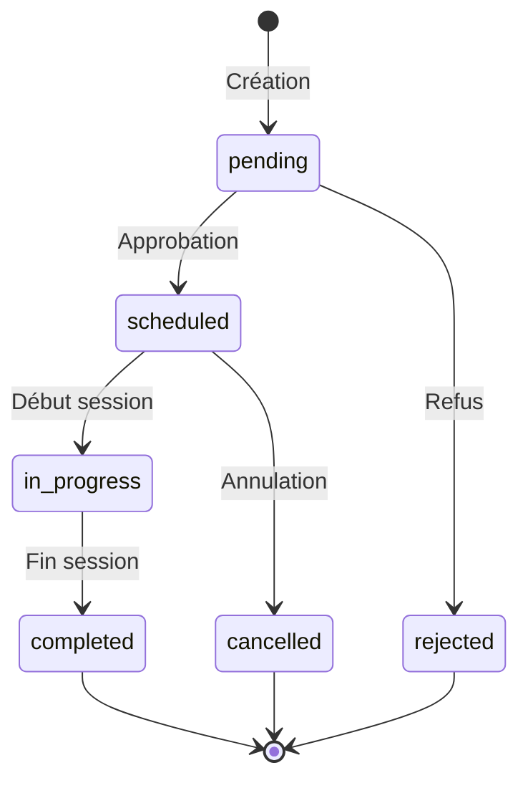
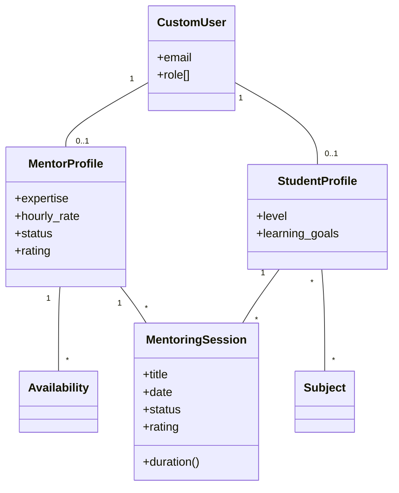
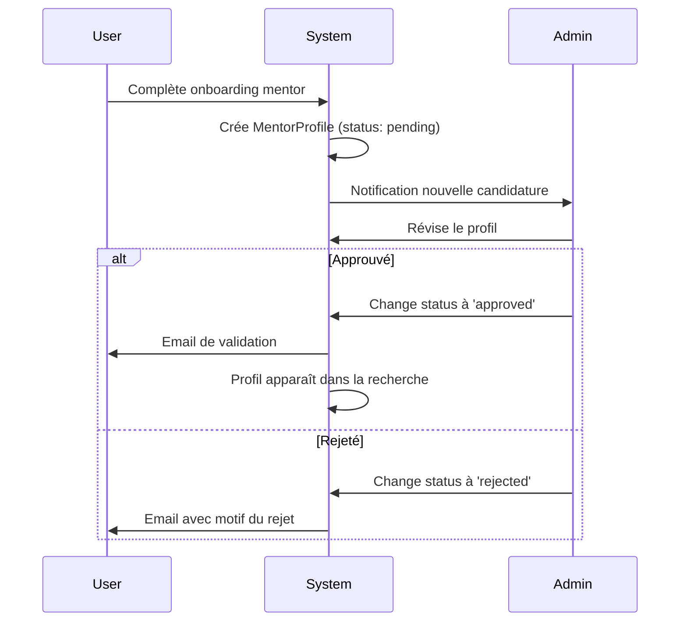

# 📘 Référence API - Application Mentoring

*Documentation technique pour développeurs*

---

## 🎯 Vue d'Ensemble

Cette documentation détaille l'architecture technique de l'application `mentoring`, ses modèles, vues, API endpoints et intégrations.

---

## 📋 Table des Matières

1. [Architecture](#architecture)
2. [Modèles de Données](#modèles-de-données)
3. [Vues Django](#vues-django)
4. [API Endpoints](#api-endpoints)
5. [Formulaires](#formulaires)
6. [Signals](#signals)
7. [Permissions et Accès](#permissions-et-accès)
8. [Templates](#templates)
9. [URLs et Routing](#urls-et-routing)
10. [Intégrations](#intégrations)

---

## 🏗️ Architecture

### Structure du Dossier

```
mentoring/
├── __init__.py
├── admin.py                 # Configuration Django Admin
├── api_views.py             # Vues API REST
├── apps.py                  # Configuration de l'application
├── forms.py                 # 7 formulaires Django
├── models.py                # 5 modèles de données
├── signals.py               # Signals pour notifications
├── urls.py                  # Configuration des routes
├── management/
│   └── commands/            # Commandes management Django
├── migrations/              # Migrations de base de données
├── static/mentoring/
│   ├── css/                 # 10 fichiers CSS
│   └── js/                  # 6 fichiers JavaScript
├── templates/mentoring/
│   ├── *.html              # Templates principaux
│   ├── fragments/          # Fragments HTMX
│   └── onboarding/         # Templates onboarding
├── tests/
│   └── *.py                # Tests unitaires
└── views/
    ├── __init__.py
    ├── main.py             # 21 vues principales
    └── onboarding/
        ├── mentee.py       # Onboarding mentorés
        └── mentor.py       # Onboarding mentors
```

### Dépendances

**Applications Django requises :**
- `accounts` - Gestion des utilisateurs (CustomUser)
- `dashboard` - Notifications et statistiques
- `core` - Fonctionnalités de base

**Packages Python :**
```python
# requirements.txt
Django==5.1.7
Pillow>=12.0.0  # Pour les images de profil
```

---

## 💾 Modèles de Données

### 1. Subject

**Fichier :** `models.py` (lignes 6-21)

**Description :** Représente les matières/sujets d'intérêt disponibles sur la plateforme.

```python
class Subject(models.Model):
    name = models.CharField(max_length=100, unique=True)
    description = models.TextField(blank=True, null=True)
    icon = models.CharField(max_length=50, blank=True, null=True)
    is_active = models.BooleanField(default=True)
    created_at = models.DateTimeField(auto_now_add=True)
    updated_at = models.DateTimeField(auto_now=True)
```

**Champs :**

| Champ | Type | Contraintes | Description |
|-------|------|-------------|-------------|
| `name` | CharField(100) | Unique, Required | Nom de la matière |
| `description` | TextField | Nullable | Description détaillée |
| `icon` | CharField(50) | Nullable | Nom de l'icône (Font Awesome) |
| `is_active` | BooleanField | Default: True | Statut actif/inactif |
| `created_at` | DateTimeField | Auto | Date de création |
| `updated_at` | DateTimeField | Auto | Dernière modification |

**Relations :**
- `students` (reverse) : ManyToMany vers StudentProfile

**Méthodes :**
- `__str__()` : Retourne `self.name`

**Meta :**
```python
class Meta:
    verbose_name = "Matière"
    verbose_name_plural = "Matières"
    ordering = ['name']
```

---

### 2. MentorProfile

**Fichier :** `models.py` (lignes 23-46)

**Description :** Extension du profil utilisateur pour les mentors. Relation OneToOne avec CustomUser.

```python
class MentorProfile(models.Model):
    user = models.OneToOneField(CustomUser, on_delete=models.CASCADE, 
                                 related_name='mentor_profile')
    expertise = models.CharField(max_length=100)
    years_of_experience = models.PositiveIntegerField()
    hourly_rate = models.DecimalField(max_digits=10, decimal_places=2)
    languages = models.CharField(max_length=200)
    certifications = models.TextField(blank=True)
    linkedin_profile = models.URLField(blank=True)
    github_profile = models.URLField(blank=True)
    website = models.URLField(blank=True)
    rating = models.DecimalField(max_digits=3, decimal_places=2, default=0.0)
    total_sessions = models.PositiveIntegerField(default=0)
    status = models.CharField(max_length=20, choices=STATUS_CHOICES, 
                              default='pending')
    is_available = models.BooleanField(default=True)
    created_at = models.DateTimeField(null=True, blank=True)
    updated_at = models.DateTimeField(auto_now=True)
```

**Champs :**

| Champ | Type | Contraintes | Description |
|-------|------|-------------|-------------|
| `user` | OneToOneField | CASCADE | Lien vers CustomUser |
| `expertise` | CharField(100) | Required | Domaine d'expertise |
| `years_of_experience` | PositiveIntegerField | Required | Années d'expérience |
| `hourly_rate` | DecimalField(10,2) | Required | Tarif horaire en € |
| `languages` | CharField(200) | Required | Langues parlées |
| `certifications` | TextField | Nullable | Certifications |
| `linkedin_profile` | URLField | Nullable | URL LinkedIn |
| `github_profile` | URLField | Nullable | URL GitHub |
| `website` | URLField | Nullable | Site web personnel |
| `rating` | DecimalField(3,2) | Default: 0.0 | Note moyenne (0-5) |
| `total_sessions` | PositiveIntegerField | Default: 0 | Nombre de sessions |
| `status` | CharField(20) | Choices, Default: 'pending' | Statut de validation |
| `is_available` | BooleanField | Default: True | Disponibilité |

**Choices pour `status` :**
```python
STATUS_CHOICES = (
    ('pending', 'En attente'),      # En attente de validation
    ('approved', 'Approuvé'),       # Validé par admin
    ('rejected', 'Rejeté'),         # Refusé par admin
)
```

**Relations :**
- `user` : OneToOne vers CustomUser
- `availabilities` (reverse) : ForeignKey depuis Availability
- `mentoring_sessions` (reverse) : ForeignKey depuis MentoringSession

**Méthodes :**
- `__str__()` : Retourne `f"Profil Mentor de {self.user.get_full_name()}"`

---

### 3. StudentProfile

**Fichier :** `models.py` (lignes 48-62)

**Description :** Extension du profil utilisateur pour les étudiants/mentorés.

```python
class StudentProfile(models.Model):
    user = models.OneToOneField(CustomUser, on_delete=models.CASCADE, 
                                 related_name='student_profile')
    level = models.CharField(max_length=50, blank=True, null=True)
    learning_goals = models.TextField(blank=True, null=True)
    interests = models.ManyToManyField(Subject, blank=True, 
                                       related_name='students')
    interests_old = models.CharField(max_length=200, blank=True, null=True)
    preferred_languages = models.CharField(max_length=200, blank=True, null=True)
    github_profile = models.URLField(blank=True, null=True)
    total_sessions = models.PositiveIntegerField(default=0)
    created_at = models.DateTimeField(null=True, blank=True)
    updated_at = models.DateTimeField(auto_now=True)
```

**Champs :**

| Champ | Type | Contraintes | Description |
|-------|------|-------------|-------------|
| `user` | OneToOneField | CASCADE | Lien vers CustomUser |
| `level` | CharField(50) | Nullable | Niveau (débutant/intermédiaire/avancé) |
| `learning_goals` | TextField | Nullable | Objectifs d'apprentissage |
| `interests` | ManyToManyField | Nullable | Centres d'intérêt (Subject) |
| `interests_old` | CharField(200) | Nullable, DEPRECATED | Ancien champ à migrer |
| `preferred_languages` | CharField(200) | Nullable | Langues préférées |
| `github_profile` | URLField | Nullable | URL GitHub |
| `total_sessions` | PositiveIntegerField | Default: 0 | Nombre de sessions |

**Relations :**
- `user` : OneToOne vers CustomUser
- `interests` : ManyToMany vers Subject
- `mentoring_sessions` (reverse) : ForeignKey depuis MentoringSession

**Méthodes :**
- `__str__()` : Retourne `f"Profil Étudiant de {self.user.get_full_name()}"`

> [!WARNING]
> Le champ `interests_old` est **DEPRECATED** et sera supprimé après migration complète vers `interests` (ManyToMany).

---

### 4. Availability

**Fichier :** `models.py` (lignes 64-86)

**Description :** Représente les créneaux horaires de disponibilité d'un mentor.

```python
class Availability(models.Model):
    mentor = models.ForeignKey(MentorProfile, on_delete=models.CASCADE, 
                               related_name='availabilities')
    day_of_week = models.IntegerField(choices=DAY_CHOICES)
    start_time = models.TimeField()
    end_time = models.TimeField()
    is_recurring = models.BooleanField(default=True)
    created_at = models.DateTimeField(null=True, blank=True)
    updated_at = models.DateTimeField(auto_now=True)
```

**Champs :**

| Champ | Type | Contraintes | Description |
|-------|------|-------------|-------------|
| `mentor` | ForeignKey | CASCADE | Mentor concerné |
| `day_of_week` | IntegerField | Choices (0-6) | Jour de la semaine |
| `start_time` | TimeField | Required | Heure de début |
| `end_time` | TimeField | Required | Heure de fin |
| `is_recurring` | BooleanField | Default: True | Récurrent chaque semaine |

**Choices pour `day_of_week` :**
```python
DAY_CHOICES = [
    (0, 'Lundi'),
    (1, 'Mardi'),
    (2, 'Mercredi'),
    (3, 'Jeudi'),
    (4, 'Vendredi'),
    (5, 'Samedi'),
    (6, 'Dimanche'),
]
```

**Meta :**
```python
class Meta:
    verbose_name_plural = "Disponibilités"
    ordering = ['day_of_week', 'start_time']
```

**Méthodes :**
- `__str__()` : Retourne `f"Disponibilité de {self.mentor.user.get_full_name()} - {self.get_day_of_week_display()}"`

---

### 5. MentoringSession

**Fichier :** `models.py` (lignes 88-125)

**Description :** Représente une session de mentorat entre un mentor et un étudiant.

```python
class MentoringSession(models.Model):
    mentor = models.ForeignKey(MentorProfile, on_delete=models.CASCADE, 
                               related_name='mentoring_sessions')
    student = models.ForeignKey(StudentProfile, on_delete=models.CASCADE, 
                                related_name='mentoring_sessions')
    title = models.CharField(max_length=200)
    description = models.TextField()
    date = models.DateField()
    start_time = models.TimeField()
    end_time = models.TimeField()
    status = models.CharField(max_length=20, choices=STATUS_CHOICES, 
                             default='pending')
    meeting_link = models.URLField(blank=True)
    notes = models.TextField(blank=True)
    rating = models.PositiveIntegerField(null=True, blank=True)
    feedback = models.TextField(blank=True)
    created_at = models.DateTimeField(null=True, blank=True, 
                                     default=timezone.now)
    updated_at = models.DateTimeField(auto_now=True)
```

**Champs :**

| Champ | Type | Contraintes | Description |
|-------|------|-------------|-------------|
| `mentor` | ForeignKey | CASCADE | Mentor de la session |
| `student` | ForeignKey | CASCADE | Étudiant de la session |
| `title` | CharField(200) | Required | Titre de la session |
| `description` | TextField | Required | Description détaillée |
| `date` | DateField | Required | Date de la session |
| `start_time` | TimeField | Required | Heure de début |
| `end_time` | TimeField | Required | Heure de fin |
| `status` | CharField(20) | Choices, Default: 'pending' | État de la session |
| `meeting_link` | URLField | Nullable | Lien de réunion |
| `notes` | TextField | Nullable | Notes de session |
| `rating` | PositiveIntegerField | Nullable, 1-5 | Note de l'étudiant |
| `feedback` | TextField | Nullable | Commentaire de l'étudiant |

**Choices pour `status` :**
```python
STATUS_CHOICES = (
    ('pending', 'En attente'),          # Demande non traitée
    ('scheduled', 'Confirmée'),         # Approuvée par le mentor
    ('in_progress', 'En cours'),        # Session en cours
    ('completed', 'Terminée'),          # Session terminée
    ('cancelled', 'Annulée'),           # Annulée par une partie
    ('rejected', 'Refusée'),            # Refusée par le mentor
)
```

**Diagramme de Transition des États :**


**Méthodes :**

**`duration()` :**
```python
def duration(self):
    """Calcule la durée de la session en minutes"""
    from datetime import datetime
    start = datetime.combine(self.date, self.start_time)
    end = datetime.combine(self.date, self.end_time)
    return (end - start).total_seconds() / 60
```

**Exemple d'utilisation :**
```python
session = MentoringSession.objects.get(id=1)
print(f"Durée: {session.duration()} minutes")  # Output: Durée: 90.0 minutes
```

**Meta :**
```python
class Meta:
    ordering = ['-date', '-start_time']  # Plus récentes en premier
```

---

## 🎮 Vues Django

### Vue de Liste des Mentors

**Classe :** `MentorListView`  
**Fichier :** `views/main.py` (lignes 30-110)  
**Type :** ListView  
**URL :** `/mentoring/mentors/`

**Fonctionnalités :**
- Liste paginée (12 mentors/page)
- Filtrage par expertise, langues, tarif
- Recherche textuelle
- Support HTMX pour navigation fluide

**Querysets :**
```python
def get_queryset(self):
    queryset = MentorProfile.objects.filter(status='approved')
    
    # Filtrage par search
    search = self.request.GET.get('search')
    if search:
        queryset = queryset.filter(
            Q(user__first_name__icontains=search) |
            Q(user__last_name__icontains=search) |
            Q(expertise__icontains=search)
        )
    
    # Filtrage par expertise
    expertise = self.request.GET.get('expertise')
    if expertise:
        queryset = queryset.filter(expertise=expertise)
    
    # Filtrage par langues
    language = self.request.GET.get('language')
    if language:
        queryset = queryset.filter(languages__icontains=language)
    
    # Filtrage par tarif max
    max_rate = self.request.GET.get('max_rate')
    if max_rate:
        queryset = queryset.filter(hourly_rate__lte=max_rate)
    
    return queryset.order_by('-rating', '-total_sessions')
```

**Contexte supplémentaire :**
```python
def get_context_data(self, **kwargs):
    context = super().get_context_data(**kwargs)
    context['expertise_choices'] = EXPERTISE_CHOICES
    context['language_choices'] = LANGUAGE_CHOICES
    return context
```

**Templates :**
- Standard : `mentoring/mentor_list.html`
- HTMX : `mentoring/fragments/mentor_list_content.html`

---

### Vues d'Onboarding

#### MenteeOnboardingView

**Fichier :** `views/onboarding/mentee.py`  
**Type :** CreateView  
**URL :** `/mentoring/onboarding/mentee/`

**Comportement :**
- Tous les champs sont optionnels
- Crée ou met à jour le StudentProfile
- Ajoute le rôle 'student' au CustomUser
- Redirige vers le dashboard

```python
class MenteeOnboardingView(LoginRequiredMixin, CreateView):
    model = StudentProfile
    form_class = MenteeOnboardingForm
    template_name = 'mentoring/onboarding/mentee.html'
    success_url = reverse_lazy('dashboard:dashboard')
    
    def form_valid(self, form):
        # Vérifier si le profil existe déjà
        try:
            profile = StudentProfile.objects.get(user=self.request.user)
            # Mettre à jour le profil existant
            for field in form.cleaned_data:
                setattr(profile, field, form.cleaned_data[field])
            profile.save()
        except StudentProfile.DoesNotExist:
            # Créer un nouveau profil
            profile = form.save(commit=False)
            profile.user = self.request.user
            profile.save()
        
        # Ajouter le rôle student
        if 'student' not in self.request.user.role:
            self.request.user.role.append('student')
            self.request.user.save()
        
        return redirect(self.success_url)
```

#### MentorOnboardingView

**Fichier :** `views/onboarding/mentor.py`  
**Type :** UpdateView  
**URL :** `/mentoring/onboarding/mentor/`

**Comportement :**
- Tous les champs sont OBLIGATOIRES
- Crée ou met à jour le MentorProfile
- Définit status='pending' (nécessite validation)
- Ajoute le rôle 'mentor' au CustomUser

```python
class MentorOnboardingView(LoginRequiredMixin, UserPassesTestMixin, UpdateView):
    model = MentorProfile
    form_class = MentorOnboardingForm
    template_name = 'mentoring/onboarding/mentor.html'
    success_url = reverse_lazy('dashboard:dashboard')
    
    def test_func(self):
        return self.request.user.role == 'mentor' or \
               'mentor' in self.request.user.role
    
    def get_object(self):
        obj, created = MentorProfile.objects.get_or_create(
            user=self.request.user,
            defaults={'status': 'pending'}
        )
        return obj
    
    def form_valid(self, form):
        mentor_profile = form.save(commit=False)
        mentor_profile.status = 'pending'  # Force le statut pendant la validation
        mentor_profile.save()
        
        # Ajouter le rôle mentor
        if 'mentor' not in self.request.user.role:
            self.request.user.role.append('mentor')
            self.request.user.save()
        
        messages.info(self.request, 
                     "Votre profil est en cours de validation par notre équipe.")
        return redirect(self.success_url)
```

---

### Vues de Gestion des Sessions

#### SessionApproveView

**Fichier :** `views/main.py` (lignes 417-433)  
**Type :** View (POST uniquement)  
**URL :** `/mentoring/sessions/<pk>/approve/`

**Permissions :** Seul le mentor concerné

```python
class SessionApproveView(LoginRequiredMixin, UserPassesTestMixin, View):
    def test_func(self):
        session = get_object_or_404(MentoringSession, pk=self.kwargs['pk'])
        return session.mentor.user == self.request.user
    
    def post(self, request, pk):
        session = get_object_or_404(MentoringSession, pk=pk)
        session.status = 'scheduled'
        session.save()
        
        messages.success(request, f"Session '{session.title}' confirmée !")
        return redirect('mentoring:session_detail', pk=pk)
```

**Effet :**
- Change le statut à 'scheduled'
- Déclenche un signal qui envoie une notification à l'étudiant
- Génère un lien de réunion Jitsi si non fourni

---

## 🔌 API Endpoints

### Liste des Mentors (API JSON)

**Endpoint :** `/mentoring/api/mentors/`  
**Méthode :** GET  
**Authentication :** Non requise  
**Fichier :** `api_views.py`

**Paramètres de requête :**

| Paramètre | Type | Description |
|-----------|------|-------------|
| `search` | string | Recherche textuelle |
| `expertise` | string | Filtrer par expertise |
| `language` | string | Filtrer par langue |
| `max_rate` | float | Tarif maximum |

**Réponse :**
```json
{
  "count": 42,
  "results": [
    {
      "id": 1,
      "name": "Jean Dupont",
      "expertise": "Développement Web",
      "years_of_experience": 5,
      "hourly_rate": "45.00",
      "rating": "4.8",
      "total_sessions": 127,
      "languages": "Français, Anglais, JavaScript, Python",
      "linkedin_profile": "https://linkedin.com/in/jeandupont",
      "is_available": true
    },
    // ...
  ]
}
```

**Exemple d'utilisation :**
```javascript
fetch('/mentoring/api/mentors/?expertise=Python&max_rate=50')
  .then(response => response.json())
  .then(data => {
    console.log(`${data.count} mentors trouvés`);
    data.results.forEach(mentor => {
      console.log(`${mentor.name} - ${mentor.hourly_rate}€/h`);
    });
  });
```

---

## 📝 Formulaires

### Structure des Formulaires

**Fichier :** `forms.py`

**Liste complète des formulaires :**

| Formulaire | Modèle | Utilisation |
|-----------|--------|-------------|
| `MentorProfileForm` | MentorProfile | Mise à jour profil mentor |
| `StudentProfileForm` | StudentProfile | Mise à jour profil étudiant |
| `AvailabilityForm` | Availability | Créer/modifier disponibilités |
| `MentoringSessionForm` | MentoringSession | Créer session (étud iant) |
| `MentorMentoringSessionForm` | MentoringSession | Créer session (mentor) |
| `SessionFeedbackForm` | MentoringSession | Ajouter feedback |
| `MenteeOnboardingForm` | StudentProfile | Onboarding mentoré |
| `MentorOnboardingForm` | MentorProfile | Onboarding mentor |

### Validation Personnalisée

**AvailabilityForm :**
```python
def clean(self):
    cleaned_data = super().clean()
    start_time = cleaned_data.get('start_time')
    end_time = cleaned_data.get('end_time')
    
    if start_time and end_time and start_time >= end_time:
        raise forms.ValidationError(
            "L'heure de fin doit être après l'heure de début."
        )
    
    return cleaned_data
```

**MentorMentoringSessionForm :**
```python
def clean(self):
    cleaned_data = super().clean()
    date = cleaned_data.get('date')
    start_time = cleaned_data.get('start_time')
    end_time = cleaned_data.get('end_time')
    
    if date and start_time and end_time:
        from datetime import datetime, date as dt_date
        
        if date < dt_date.today():
            raise forms.ValidationError(
                "La date ne peut pas être dans le passé."
            )
        
        if start_time >= end_time:
            raise forms.ValidationError(
                "L'heure de fin doit être après l'heure de début."
            )
    
    return cleaned_data
```

---

## 🔔 Signals

**Fichier :** `signals.py`

### Signal post_save sur MentoringSession

**Déclencheurs :**
- Création de session (created=True, status='pending')
- Changement de statut (created=False)

**Notifications envoyées :**

| Événement | Destinataire | Type | Titre |
|-----------|--------------|------|-------|
| Session créée (pending) | Mentor | `new_request` | "Nouvelle demande de session" |
| Session approuvée (scheduled) | Étudiant | `session_confirmed` | "Session confirmée !" |
| Session rejetée (rejected) | Étudiant | `session_cancelled` | "Demande refusée" |

**Code :**
```python
from django.db.models.signals import post_save
from django.dispatch import receiver
from .models import MentoringSession
from dashboard.models import Notification

@receiver(post_save, sender=MentoringSession)
def notify_session_status_change(sender, instance, created, **kwargs):
    if created and instance.status == 'pending':
        # Notification au mentor pour nouvelle demande
        Notification.objects.create(
            user=instance.mentor.user,
            type='new_request',
            title='Nouvelle demande de session',
            message=f"{instance.student.user.get_full_name()} souhaite réserver une session : {instance.title}",
            link=f'/mentoring/sessions/{instance.id}/'
        )
    
    elif not created:
        if instance.status == 'scheduled':
            # Notification à l'étudiant (session confirmée)
            Notification.objects.create(
                user=instance.student.user,
                type='session_confirmed',
                title='Session confirmée !',
                message=f"Votre session '{instance.title}' avec {instance.mentor.user.get_full_name()} est confirmée.",
                link=f'/dashboard/sessions/{instance.id}/'
            )
        
        elif instance.status == 'rejected':
            # Notification à l'étudiant (session refusée)
            Notification.objects.create(
                user=instance.student.user,
                type='session_cancelled',
                title='Demande de session refusée',
                message=f"Votre demande pour la session '{instance.title}' a été refusée par le mentor.",
                link='/mentoring/sessions/'
            )
```

---

## 🔒 Permissions et Accès

### Mixins Utilisés

**LoginRequiredMixin :**
- Toutes les vues sauf `MentorListView` et `PublicMentorProfileView`

**UserPassesTestMixin :**
- Vérification du rôle (mentor/student)
- Vérification de propriété (modifier SES sessions uniquement)

### Exemples de Permissions

**Vue réservée aux mentors :**
```python
class AvailabilityCreateView(LoginRequiredMixin, UserPassesTestMixin, CreateView):
    def test_func(self):
        return 'mentor' in self.request.user.role
```

**Vue avec vérification de propriété :**
```python
class MentoringSessionUpdateView(LoginRequiredMixin, UserPassesTestMixin, UpdateView):
    def test_func(self):
        session = self.get_object()
        # Seul le créateur peut modifier
        return (session.mentor.user == self.request.user or
                session.student.user == self.request.user)
```

---

## 🎨 Templates

### Organisation

```
templates/mentoring/
├── mentor_list.html                # Liste des mentors
├── mentor_public_profile.html      # Profil public mentor
├── mentor_profile_update.html      # Édition profil mentor
├── student_profile.html            # Profil étudiant
├── student_profile_update.html     # Édition profil étudiant
├── availability_list.html          # Liste disponibilités
├── availability_form.html          # Formulaire disponibilité
├── availability_confirm_delete.html # Confirmation suppression
├── session_form.html               # Formulaire création session
├── session_feedback.html           # Formulaire feedback
├── mentor_dashboard.html           # Dashboard mentor
├── student_dashboard.html          # Dashboard étudiant
├── fragments/
│   └── mentor_card.html           # Carte mentor (liste)
└── onboarding/
    ├── mentee.html                # Onboarding mentoré
    └── mentor.html                # Onboarding mentor
```

### Support HTMX

Les templates gèrent deux modes :
- **Requête normale** : Template complet avec base
- **Requête HTMX** : Fragment HTML seulement

**Exemple dans la vue :**
```python
def get_template_names(self):
    if self.request.htmx:
        return ['mentoring/fragments/mentor_list_content.html']
    return ['mentoring/mentor_list.html']
```

---

## 🔗 URLs et Routing

**Fichier :** `urls.py`  
**Namespace :** `mentoring`

**Configuration complète (18 routes) :**

```python
from django.urls import path
from . import views, api_views

app_name = 'mentoring'

urlpatterns = [
    # Profils et mentors
    path('mentors/', views.MentorListView.as_view(), name='mentor_list'),
    path('mentor/<int:pk>/', views.PublicMentorProfileView.as_view(), name='mentor_detail'),
    path('mentor/profile/update/', views.MentorProfileUpdateView.as_view(), name='mentor_profile_update'),
    path('student/profile/', views.StudentProfileView.as_view(), name='student_profile'),
    path('student/profile/update/', views.StudentProfileUpdateView.as_view(), name='student_profile_update'),
    
    # Disponibilités
    path('mentor/availabilities/', views.AvailabilityListView.as_view(), name='availability_list'),
    path('mentor/availabilities/create/', views.AvailabilityCreateView.as_view(), name='availability_create'),
    path('mentor/availabilities/<int:pk>/update/', views.AvailabilityUpdateView.as_view(), name='availability_update'),
    path('mentor/availabilities/<int:pk>/delete/', views.AvailabilityDeleteView.as_view(), name='availability_delete'),
    
    # Sessions
    path('sessions/', views.MentoringSessionListView.as_view(), name='session_list'),
    path('sessions/<int:pk>/', views.MentoringSessionDetailView.as_view(), name='session_detail'),
    path('sessions/create/<int:mentor_id>/', views.MentoringSessionCreateView.as_view(), name='session_create'),
    path('mentor/sessions/create/', views.MentorMentoringSessionCreateView.as_view(), name='mentor_session_create'),
    path('sessions/<int:pk>/update/', views.MentoringSessionUpdateView.as_view(), name='session_update'),
    path('sessions/<int:pk>/delete/', views.MentoringSessionDeleteView.as_view(), name='session_delete'),
    path('sessions/<int:pk>/approve/', views.SessionApproveView.as_view(), name='session_approve'),
    path('sessions/<int:pk>/reject/', views.SessionRejectView.as_view(), name='session_reject'),
    path('sessions/<int:pk>/feedback/', views.SessionFeedbackView.as_view(), name='session_feedback'),
    
    # Onboarding
    path('onboarding/mentee/', views.MenteeOnboardingView.as_view(), name='mentee_onboarding'),
    path('onboarding/mentee/skip/', views.SkipMenteeOnboardingView.as_view(), name='skip_mentee_onboarding'),
    path('onboarding/mentor/', views.MentorOnboardingView.as_view(), name='mentor_onboarding'),
    
    # API
    path('api/mentors/', api_views.MentorListAPIView.as_view(), name='mentor_list_api'),
]
```

**Utilisation dans les templates :**
```django




```

---

## 🌐 Intégrations

### Jitsi Meet

**Fichier :** `templates/dashboard/sessions/video_room.html`

**Configuration :**
```javascript
const domain = 'meet.jit.si';
const options = {
    roomName: '{{ room_name }}',  // Généré: session-{id}-{timestamp}
    width: '100%',
    height: '100%',
    parentNode: document.querySelector('#jitsi-container'),
    userInfo: {
        email: '{{ request.user.email }}',
        displayName: '{{ user_name|escapejs }}'
    },
    lang: 'fr',
    configOverwrite: { 
        startWithAudioMuted: false,
        startWithVideoMuted: false,
        prejoinPageEnabled: false
    },
    interfaceConfigOverwrite: { 
        SHOW_JITSI_WATERMARK: false,
        TOOLBAR_BUTTONS: [...]
    }
};
const api = new JitsiMeetExternalAPI(domain, options);
```

**Génération du nom de salle :**
```python
# Dans la vue
room_name = f"session-{session.id}-{int(time.time())}"
context['room_name'] = room_name
```

### Notifications (Dashboard App)

**Dépendance :** App `dashboard` pour le modèle `Notification`

**Import :**
```python
from dashboard.models import Notification
```

---

## 📊 Diagrammes

### Diagramme de Classes (Relations)



### Workflow de Validation Mentor



---

## 🧪 Tests

### Structure Recommandée

**À créer :**
```
tests/
├── __init__.py
├── test_models.py
├── test_views.py
├── test_forms.py
├── test_permissions.py
├── test_signals.py
└── test_onboarding.py
```

### Exemples de Tests

**Test modèle MentorProfile :**
```python
from django.test import TestCase
from accounts.models import CustomUser
from mentoring.models import MentorProfile

class MentorProfileTestCase(TestCase):
    def setUp(self):
        self.user = CustomUser.objects.create_user(
            email='mentor@test.com',
            password='testpass123'
        )
    
    def test_create_mentor_profile(self):
        mentor = MentorProfile.objects.create(
            user=self.user,
            expertise='Python',
            years_of_experience=5,
            hourly_rate=50.00,
            languages='Français, Python'
        )
        self.assertEqual(mentor.status, 'pending')
        self.assertEqual(mentor.total_sessions, 0)
        self.assertEqual(mentor.rating, 0.0)
    
    def test_mentor_profile_str(self):
        mentor = MentorProfile.objects.create(
            user=self.user,
            expertise='Python',
            years_of_experience=5,
            hourly_rate=50.00,
            languages='Français'
        )
        self.assertIn(self.user.email, str(mentor))
```

**Test vue MentorListView :**
```python
from django.test import TestCase, Client
from django.urls import reverse

class MentorListViewTestCase(TestCase):
    def setUp(self):
        self.client = Client()
        # Créer des mentors de test
    
    def test_mentor_list_accessible(self):
        url = reverse('mentoring:mentor_list')
        response = self.client.get(url)
        self.assertEqual(response.status_code, 200)
    
    def test_mentor_list_shows_only_approved(self):
        # Créer mentor pending et approved
        # Vérifier que seul approved est affiché
        pass
```

---

## 📚 Ressources

- [Documentation Django](https://docs.djangoproject.com/)
- [Django Class-Based Views](https://ccbv.co.uk/)
- [HTMX Documentation](https://htmx.org/)
- [Jitsi Meet API](https://jitsi.github.io/handbook/)

---

*Documentation générée pour MentorXHub - Application Mentoring*
