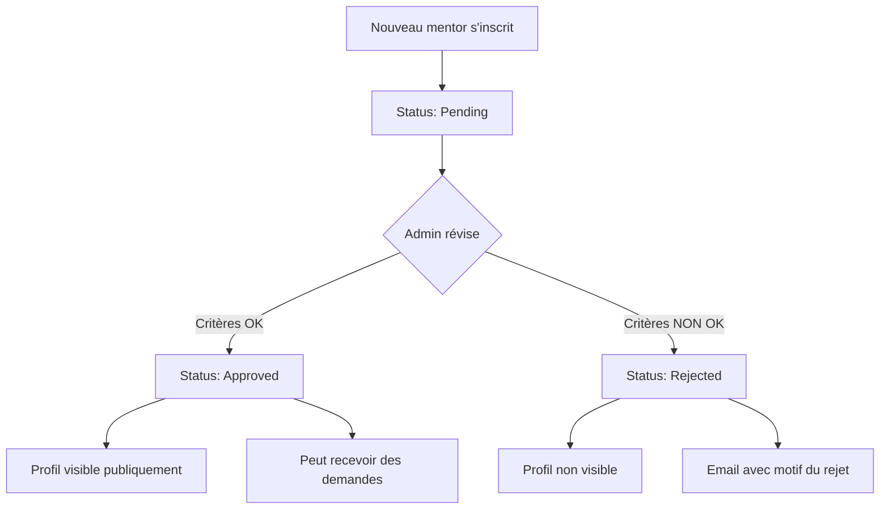

# 🔧 Guide Administrateur - Application Mentoring

*Documentation technique pour les administrateurs système*

---

## 🎯 Vue d'Ensemble

Ce guide est destiné aux **administrateurs** de MentorXHub qui gèrent l'application `mentoring` via l'interface Django Admin et effectuent des tâches de maintenance.

---

## 📋 Table des Matières

1. [Accès à l'Administration](#accès-à-ladministration)
2. [Gestion des Matières](#gestion-des-matières)
3. [Validation des Mentors](#validation-des-mentors)
4. [Gestion des Disponibilités](#gestion-des-disponibilités)
5. [Modération des Sessions](#modération-des-sessions)
6. [Gestion des Utilisateurs](#gestion-des-utilisateurs)
7. [Commandes de Maintenance](#commandes-de-maintenance)
8. [Statistiques et Rapports](#statistiques-et-rapports)
9. [Résolution de Problèmes](#résolution-de-problèmes)
10. [Sauvegardes et Sécurité](#sauvegardes-et-sécurité)

---

## 🔐 Accès à l'Administration

### Interface Django Admin

**URL :** `https://votre-domaine.com/admin/`

**Connexion :**
1. Utilisez vos identifiants super-utilisateur
2. Email + mot de passe

**Créer un super-utilisateur :**
```bash
# En production
python manage.py createsuperuser

# Avec l'environnement virtuel
.\mon_env\Scripts\python.exe manage.py createsuperuser
```

**Informations demandées :**
- Email address
- Password
- Password (again)

### Permissions

**Niveaux d'accès :**

| Niveau | Permissions | Utilisateurs |
|--------|-------------|--------------|
| **Super-utilisateur** | Accès complet | Vous |
| **Staff** | Accès limité à certains modèles | Équipe support |
| **Utilisateur normal** | Pas d'accès admin | Mentors/Mentorés |

**Créer un membre staff :**
```python
# Shell Django
python manage.py shell

from accounts.models import CustomUser
user = CustomUser.objects.get(email='support@mentorxhub.com')
user.is_staff = True
user.save()
```

---

## 📚 Gestion des Matières

### Accéder aux Matières

**Navigation :** Admin > Mentoring > Matières (Subjects)

### Créer une Matière

1. Cliquez sur **"Ajouter Matière"**
2. Remplissez les champs :

| Champ | Description | Exemple |
|-------|-------------|---------|
| **Nom** | Nom unique de la matière | "Data Science" |
| **Description** | Description détaillée | "Analyse de données, ML, IA..." |
| **Icône** | Nom d'icône Font Awesome | "fa-chart-line" |
| **Actif** | ☑ Afficher sur la plateforme | ☑ |

3. Cliquez sur **"Sauvegarder"**

### Modifier/Désactiver une Matière

**Méthode rapide :**
1. Liste des matières
2. Décochez "Actif" dans la colonne
3. Auto-sauvegarde

**Méthode détaillée :**
1. Cliquez sur le nom de la matière
2. Modifiez les champs
3. Sauvegardez

> [!IMPORTANT]
> La désactivation d'une matière la masque de la sélection pour les nouveaux profils, mais ne supprime pas les liens existants.

### Supprimer une Matière

> [!WARNING]
> La suppression d'une matière supprimera tous les liens avec les profils étudiants. Privilégiez la désactivation.

**Procédure :**
1. Sélectionnez la matière à supprimer
2. Action > "Supprimer les matières sélectionnées"
3. Confirmez la suppression

**Vérifications avant suppression :**
```python
# Shell Django
from mentoring.models import Subject
subject = Subject.objects.get(name='Nom de la matière')
students_count = subject.students.count()
print(f"{students_count} étudiants concernés")
```

---

## ✅ Validation des Mentors

C'est votre tâche la plus importante ! Vous devez valider ou rejeter les candidatures de mentors.

### Workflow de Validation



### Accéder aux Candidatures

**Méthode 1 : Admin Django**
1. Admin > Mentoring > Mentor Profiles
2. Filtrer par **Status: Pending**

**Méthode 2 : Dashboard (si implémenté)**
1. Dashboard Admin > Applications en attente

### Critères de Validation

**Vérifications obligatoires :**

| Critère | Comment vérifier |
|---------|------------------|
| **Profil LinkedIn authentique** | Cliquer sur le lien, vérifier l'existence et la cohérence |
| **Expérience cohérente** | Années déclarées correspondent au profil |
| **Expertise réelle** | Vérifier via LinkedIn, GitHub ou recherche Google |
| **Tarif raisonnable** | Proportionnel à l'expérience (20€-100€/h) |

**Signaux d'alerte (rejeter) :**
- ❌ Profil LinkedIn inexistant ou incomplet
- ❌ Incohérence entre expertise et expérience
- ❌ Informations manifestement fausses
- ❌ Tarif démesuré (>150€/h sans justification)
- ❌ Profil suspect ou spam

**Signaux positifs (valider) :**
- ✅ Profil LinkedIn complet et professionnel
- ✅ Certifications mentionnées
- ✅ Expérience vérifiable
- ✅ Présence GitHub avec projets
- ✅ Site web ou portfolio

### Procédure de Validation

**Approuver un mentor :**
1. Ouvrez le profil du mentor
2. Vérifiez tous les critères
3. Changez **Status** à **"Approved"**
4. Cliquez sur **"Sauvegarder"**

**effet :**
- Le mentor reçoit un email de confirmation
- Son profil devient visible dans la recherche
- Il peut recevoir des demandes de sessions

**Rejeter un mentor :**
1. Ouvrez le profil du mentor
2. Changez **Status** à **"Rejected"**
3. (Optionnel) Ajoutez une note dans un champ personnalisé
4. Sauvegardez

> [!TIP]
> **Bonne pratique :** Contactez le mentor par email pour expliquer le refus et lui donner une chance d'améliorer son profil.

**Template d'email de refus :**
```
Objet : Candidature MentorXHub - Informations complémentaires requises

Bonjour [Nom],

Merci pour votre intérêt à rejoindre MentorXHub en tant que mentor.

Après révision de votre profil, nous avons besoin d'informations 
complémentaires avant de pouvoir valider votre candidature :

- [Raison spécifique, ex: Profil LinkedIn incomplet]
- [Autre raison si applicable]

Nous vous invitons à mettre à jour vos informations et à soumettre 
une nouvelle candidature.

Cordialement,
L'équipe MentorXHub
```

### Actions en Masse

**Approuver plusieurs mentors :**
1. Cochez les mentors à approuver
2. Action > "Approuver les profils sélectionnés" (action personnalisée)
3. Confirmez

**Créer une action personnalisée :**
```python
# mentoring/admin.py
from django.contrib import admin

@admin.register(MentorProfile)
class MentorProfileAdmin(admin.ModelAdmin):
    actions = ['approve_mentors', 'reject_mentors']
    
    def approve_mentors(self, request, queryset):
        count = queryset.update(status='approved')
        self.message_user(request, f"{count} mentor(s) approuvé(s).")
    approve_mentors.short_description = "Approuver les mentors sélectionnés"
    
    def reject_mentors(self, request, queryset):
        count = queryset.update(status='rejected')
        self.message_user(request, f"{count} mentor(s) rejeté(s).")
    reject_mentors.short_description = "Rejeter les mentors sélectionnés"
```

---

## 📅 Gestion des Disponibilités

### Accéder aux Disponibilités

**Navigation :** Admin > Mentoring > Availabilities

### Interface de Liste

**Colonnes affichées :**
- Mentor
- Jour de la semaine
- Heure de début
- Heure de fin
- Récurrent (Oui/Non)

**Filtres disponibles :**
- Jour de la semaine
- Récurrent
- Date de création

### Modifier une Disponibilité

**Cas d'usage :** Un mentor a créé une disponibilité incorrecte et ne peut pas la modifier.

**Procédure :**
1. Recherchez la disponibilité (par nom du mentor)
2. Cliquez dessus pour éditer
3. Modifiez les champs
4. Sauvegardez

### Supprimer une Disponibilité

**Cas d'usage :** Disponibilité obsolète ou erreur.

**Procédure :**
1. Sélectionnez la disponibilité
2. Cliquez sur "Supprimer"
3. Confirmez

> [!WARNING]
> La suppression d'une disponibilité n'annule pas les sessions déjà confirmées sur ce créneau.

---

## 🎓 Modération des Sessions

### Accéder aux Sessions

**Navigation :** Admin > Mentoring > Mentoring Sessions

### Interface de Liste

**Colonnes affichées :**
- Titre
- Mentor
- Étudiant
- Date
- Heure de début
- Heure de fin
- **Status** (modifiable en ligne)
- Rating

**Filtres :**
- **Status** : Tous, Pending, Scheduled, Completed, Cancelled, Rejected
- **Date** : Aujourd'hui, Cette semaine, Ce mois
- **Créé le** : Date de création

**Recherche :**
- Titre de session
- Email du mentor
- Email de l'étudiant
- Description

### Modifier le Statut d'une Session

**Modification rapide (depuis la liste) :**
1. Changez le statut directement dans la colonne "Status"
2. La sauvegarde est automatique

**Modification détaillée :**
1. Cliquez sur la session
2. Modifiez le statut
3. Sauvegardez

**Cas d'usage courants :**

| Situation | Action |
|-----------|--------|
| Session non honorée par le mentor | Status: Cancelled + Note |
| Étudiant ne s'est pas présenté | Status: Cancelled + Note "No-show" |
| Problème technique empêchant la session | Status: Cancelled, recréer la session |
| Litige entre mentor et étudiant | Investiguer, puis marquer Cancelled si nécessaire |

### Fieldsets (Vue Détaillée)

L'édition de session est organisée en sections :

**1. Informations de la session**
- Titre
- Description
- Mentor
- Étudiant

**2. Planning**
- Date
- Heure de début
- Heure de fin
- Status
- Lien de réunion

**3. Feedback**
- Notes
- Rating (1-5)
- Feedback textuel

---

## 👥 Gestion des Utilisateurs

### Accéder aux Utilisateurs

**Navigation :** Admin > Accounts > Users

### Profils Mentor et Étudiant

**Vérifier les profils liés :**
1. Cliquez sur un utilisateur
2. En bas de page, sections :
   - **Mentor profile** (si rôle mentor)
   - **Student profile** (si rôle student)

### Créer Manuellement un Profil

**Cas d'usage :** Un utilisateur a un compte mais pas de profil mentor/étudiant.

**Création via Shell :**
```python
python manage.py shell

from accounts.models import CustomUser
from mentoring.models import MentorProfile, StudentProfile

# Créer un profil mentor
user = CustomUser.objects.get(email='mentor@example.com')
mentor = MentorProfile.objects.create(
    user=user,
    expertise='Python Development',
    years_of_experience=5,
    hourly_rate=50.00,
    languages='Français, Python',
    linkedin_profile='https://linkedin.com/in/...',
    status='pending'
)

# Créer un profil étudiant
user = CustomUser.objects.get(email='student@example.com')
student = StudentProfile.objects.create(
    user=user,
    level='débutant',
    learning_goals='Apprendre Python'
)
```

### Supprimer un Utilisateur

> [!CAUTION]
> La suppression d'un utilisateur supprime **TOUTES** ses données associées (profils, sessions, etc.) via CASCADE.

**Procédure sécurisée :**
1. Vérifiez les relations :
   ```python
   user = CustomUser.objects.get(email='user@example.com')
   
   # Vérifier profil mentor
   try:
       mentor = user.mentor_profile
       print(f"Sessions mentor: {mentor.mentoring_sessions.count()}")
   except:
       pass
   
   # Vérifier profil étudiant
   try:
       student = user.student_profile
       print(f"Sessions étudiant: {student.mentoring_sessions.count()}")
   except:
       pass
   ```

2. Sauvegardez les données importantes
3. Supprimez l'utilisateur depuis l'admin

---

## 🛠️ Commandes de Maintenance

### Commandes Django Disponibles

**Liste des commandes personnalisées :**
```bash
python manage.py help
# Cherchez dans la section [mentoring]
```

### Créer des Données de Test

**Commande (si implémentée) :**
```bash
python manage.py create_test_mentors --count=10
python manage.py create_test_sessions --count=20
```

**Script manuel :**
```python
# create_test_data.py
from accounts.models import CustomUser
from mentoring.models import MentorProfile, Subject
import random

# Créer des matières
subjects = ['Python', 'JavaScript', 'Data Science', 'Web Design', 'DevOps']
for subject_name in subjects:
    Subject.objects.get_or_create(
        name=subject_name,
        defaults={'is_active': True}
    )

# Créer des mentors de test
for i in range(10):
    user = CustomUser.objects.create_user(
        email=f'mentor{i}@test.com',
        password='testpass123',
        first_name=f'Mentor{i}',
        last_name='Test'
    )
    user.role.append('mentor')
    user.save()
    
    MentorProfile.objects.create(
        user=user,
        expertise=random.choice(subjects),
        years_of_experience=random.randint(1, 10),
        hourly_rate=random.randint(20, 80),
        languages='Français, Anglais',
        linkedin_profile=f'https://linkedin.com/in/mentor{i}',
        status='approved'
    )
```

**Exécution :**
```bash
python manage.py shell < create_test_data.py
```

### Nettoyer les Données Obsolètes

**Supprimer les sessions anciennes (>1 an) :**
```python
from datetime import datetime, timedelta
from mentoring.models import MentoringSession

one_year_ago = datetime.now().date() - timedelta(days=365)
old_sessions = MentoringSession.objects.filter(
    date__lt=one_year_ago,
    status='completed'
)
count = old_sessions.count()
old_sessions.delete()
print(f"{count} sessions supprimées")
```

### Migrer le Champ `interests`

**Migration de `interests_old` vers `interests` ManyToMany :**
```python
from mentoring.models import StudentProfile, Subject

for profile in StudentProfile.objects.all():
    if profile.interests_old:
        # Parser les intérêts anciens (séparés par virgules)
        old_interests = [i.strip() for i in profile.interests_old.split(',')]
        
        for interest_name in old_interests:
            # Créer ou récupérer le Subject
            subject, created = Subject.objects.get_or_create(
                name=interest_name,
                defaults={'is_active': True}
            )
            # Ajouter à la relation ManyToMany
            profile.interests.add(subject)
        
        print(f"Migré {len(old_interests)} intérêts pour {profile.user.email}")

print("Migration terminée!")
```

---

## 📊 Statistiques et Rapports

### Obtenir des Statistiques

**Shell Django :**
```python
from mentoring.models import MentorProfile, StudentProfile, MentoringSession
from django.db.models import Count, Avg

# Nombre total de mentors
total_mentors = MentorProfile.objects.count()
approved_mentors = MentorProfile.objects.filter(status='approved').count()
pending_mentors = MentorProfile.objects.filter(status='pending').count()

print(f"Mentors total: {total_mentors}")
print(f"Approuvés: {approved_mentors}")
print(f"En attente: {pending_mentors}")

# Nombre total d'étudiants
total_students = StudentProfile.objects.count()
print(f"Étudiants: {total_students}")

# Sessions par statut
sessions_by_status = MentoringSession.objects.values('status').annotate(count=Count('id'))
for stat in sessions_by_status:
    print(f"{stat['status']}: {stat['count']}")

# Note moyenne des mentors
avg_rating = MentorProfile.objects.aggregate(Avg('rating'))
print(f"Note moyenne: {avg_rating['rating__avg']:.2f}/5")

# Top 10 mentors par nombre de sessions
top_mentors = MentorProfile.objects.order_by('-total_sessions')[:10]
for mentor in top_mentors:
    print(f"{mentor.user.get_full_name()}: {mentor.total_sessions} sessions")
```

### Générer un Rapport CSV

**Exporter toutes les sessions :**
```python
import csv
from mentoring.models import MentoringSession

with open('sessions_report.csv', 'w', newline='', encoding='utf-8') as f:
    writer = csv.writer(f)
    writer.writerow(['ID', 'Titre', 'Mentor', 'Étudiant', 'Date', 'Statut', 'Note'])
    
    for session in MentoringSession.objects.all():
        writer.writerow([
            session.id,
            session.title,
            session.mentor.user.get_full_name(),
            session.student.user.get_full_name(),
            session.date,
            session.status,
            session.rating or ''
        ])

print("Rapport généré: sessions_report.csv")
```

---

## 🔧 Résolution de Problèmes

### Problèmes Courants

#### 1. Mentor Validé Mais Profil Non Visible

**Vérifications :**
```python
mentor = MentorProfile.objects.get(user__email='mentor@example.com')
print(f"Status: {mentor.status}")  # Doit être 'approved'
print(f"Disponible: {mentor.is_available}")  # Doit être True
```

**Solution :**
```python
mentor.status = 'approved'
mentor.is_available = True
mentor.save()
```

#### 2. Session Bloquée en Status "pending"

**Cause possible :** Le mentor n'a pas reçu la notification.

**Solution :**
1. Vérifiez que le signal fonctionne
2. Envoyez une notification manuellement :
   ```python
   from dashboard.models import Notification
   
   session = MentoringSession.objects.get(id=123)
   Notification.objects.create(
       user=session.mentor.user,
       type='new_request',
       title='Nouvelle demande de session',
       message=f"{session.student.user.get_full_name()} souhaite réserver une session",
       link=f'/mentoring/sessions/{session.id}/'
   )
   ```

#### 3. Erreur "interests" ManyToMany

**Erreur :**
```
'StudentProfile' object has no attribute 'interests'
```

**Cause :** Migration non appliquée.

**Solution :**
```bash
python manage.py makemigrations mentoring
python manage.py migrate mentoring
```

#### 4. Profil Dupliqué

**Cause :** Création manuelle incorrecte.

**Solution :**
```python
# Trouver les doublons
from mentoring.models import MentorProfile
from django.db.models import Count

duplicates = MentorProfile.objects.values('user').annotate(
    count=Count('id')
).filter(count__gt=1)

for dup in duplicates:
    profiles = MentorProfile.objects.filter(user_id=dup['user'])
    # Garder le plus récent, supprimer les autres
    to_delete = profiles.order_by('-created_at')[1:]
    for profile in to_delete:
        profile.delete()
```

---

## 🔒 Sauvegardes et Sécurité

### Sauvegardes de Base de Données

**Sauvegarde SQLite (développement) :**
```bash
# Copier le fichier db.sqlite3
cp db.sqlite3 backups/db_backup_$(date +%Y%m%d).sqlite3
```

**Sauvegarde PostgreSQL (production) :**
```bash
pg_dump -U username -d mentorxhub > backups/mentorxhub_$(date +%Y%m%d).sql
```

**Automatiser les sauvegardes (cron) :**
```bash
# Ouvrir crontab
crontab -e

# Ajouter une sauvegarde quotidienne à 2h du matin
0 2 * * * pg_dump -U username -d mentorxhub > /backups/mentorxhub_$(date +\%Y\%m\%d).sql
```

### Sécurité

**Bonnes pratiques :**

- ✅ Changez le SECRET_KEY en production
- ✅ N'utilisez jamais DEBUG=True en production
- ✅ Limitez les accès admin par IP si possible
- ✅ Utilisez HTTPS obligatoirement
- ✅ Auditez régulièrement les accès admin

**Log des actions admin :**
```python
# Django enregistre automatiquement les actions admin
from django.contrib.admin.models import LogEntry

# Voir les dernières actions
for log in LogEntry.objects.order_by('-action_time')[:20]:
    print(f"{log.action_time}: {log.user} - {log.action_flag} - {log.object_repr}")
```

---

## 📚 Ressources

- [Documentation Django Admin](https://docs.djangoproject.com/en/stable/ref/contrib/admin/)
- [Guide Référence API](API_REFERENCE.md)
- [État Complet Application](ETAT_COMPLET_APP_MENTORING.md)

---

*Guide généré pour MentorXHub - Administration Application Mentoring*
