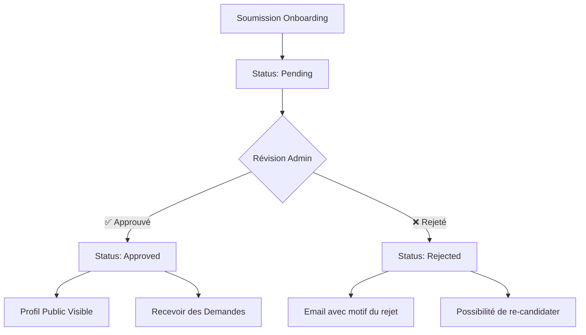

# 🎓 Guide Complet pour les Mentors - MentorXHub

*Documentation utilisateur - Application Mentoring*

---

## 🎯 Bienvenue aux Mentors !

Ce guide vous accompagne dans votre rôle de **mentor** sur MentorXHub. Vous apprendrez à configurer votre profil, gérer vos disponibilités, accepter des sessions et devenir un mentor d'exception.

---

## 📋 Table des Matières

1. [Devenir Mentor](#devenir-mentor)
2. [Processus de Validation](#processus-de-validation)
3. [Configurer Votre Profil](#configurer-votre-profil)
4. [Gérer Vos Disponibilités](#gérer-vos-disponibilités)
5. [Gérer les Demandes de Sessions](#gérer-les-demandes-de-sessions)
6. [Créer une Session pour un Étudiant](#créer-une-session-pour-un-étudiant)
7. [Conduire une Session](#conduire-une-session)
8. [Statistiques et Performance](#statistiques-et-performance)
9. [Bonnes Pratiques](#bonnes-pratiques)
10. [FAQ Mentors](#faq-mentors)

---

## 🚀 Devenir Mentor

### Prérequis

Pour devenir mentor sur MentorXHub, vous devez :
- ✅ Avoir une expertise avérée dans un domaine
- ✅ Être capable de transmettre vos connaissances
- ✅ Disposer de temps pour des sessions régulières
- ✅ Avoir un profil LinkedIn à jour

### Créer un Compte

**Option A : Inscription par Email**
1. Rendez-vous sur [mentorxhub.com/signup](https://mentorxhub.com/signup)
2. Remplissez le formulaire d'inscription
3. Confirmez votre email

**Option B : Connexion avec Google**
1. Cliquez sur "Continuer avec Google"
2. Autorisez l'accès à vos informations de base

### Sélection du Rôle

Après la première connexion :
1. La page de sélection de rôle s'affiche
2. Choisissez **"Mentor"**
3. Cliquez sur "Continuer"

> [!IMPORTANT]
> En tant que mentor, vous devez **obligatoirement** compléter le processus d'onboarding. Tous les champs sont requis pour garantir la qualité du service.

### Formulaire d'Onboarding Mentor

**Informations obligatoires :**

| Champ | Description | Exemple |
|-------|-------------|---------|
| **Expertise** | Votre domaine principal | "Développement Web Full-Stack" |
| **Années d'expérience** | Expérience professionnelle | 5 |
| **Tarif horaire** | Prix par heure (en €) | 45.00 |
| **Langues** | Langues parlées + tech | "Français, Anglais, JavaScript, Python" |
| **Profil LinkedIn** | URL complète | https://linkedin.com/in/votre-profil |

**Informations optionnelles :**
- Certifications
- Profil GitHub
- Site web personnel

**Conseils pour un bon onboarding :**
- ✅ Soyez précis dans votre expertise
- ✅ Définissez un tarif compétitif
- ✅ Mentionnez toutes vos compétences techniques
- ✅ Assurez-vous que votre LinkedIn est à jour

Après soumission, cliquez sur **"Soumettre ma candidature"**.

---

## ✅ Processus de Validation

### Workflow de Validation



### Statuts Possibles

| Statut | Signification | Actions disponibles |
|--------|---------------|-------------------|
| 🟡 **Pending** | En attente de validation | Consulter dashboard limité |
| 🟢 **Approved** | Profil validé et actif | Toutes fonctionnalités |
| 🔴 **Rejected** | Candidature refusée | Lire motif, re-candidater |

### Pendant la Validation (Status: Pending)

**Ce que vous pouvez faire :**
- ✅ Accéder au dashboard mentor
- ✅ Compléter votre profil
- ✅ Configurer vos disponibilités
- ✅ Consulter la documentation

**Ce que vous ne pouvez PAS faire :**
- ❌ Apparaître dans la recherche publique
- ❌ Recevoir des demandes de sessions
- ❌ Créer des sessions

### Délai de Validation

- **Délai moyen** : 24-48 heures
- **Jours ouvrés** : Du lundi au vendredi
- **Notification** : Vous recevez un email dès que le statut change

### Critères de Validation

L'équipe MentorXHub vérifie :
- ✅ Authenticité du profil LinkedIn
- ✅ Cohérence de l'expertise déclarée
- ✅ Expérience professionnelle
- ✅ Qualité du profil

> [!TIP]
> Un profil complet avec des liens vers vos projets, certifications ou articles augmente vos chances d'approbation rapide !

---

## 👤 Configurer Votre Profil

Un profil attractif est essentiel pour attirer des mentorés !

### Accéder à Votre Profil

1. **Dashboard** > **Mon Profil**
2. Ou cliquez sur votre **avatar** en haut à droite

### Sections du Profil

#### 1. **Informations de Base**

Ces informations sont publiques et visibles par tous les mentorés.

| Champ | Conseils |
|-------|----------|
| **Photo de profil** | Photo professionnelle, souriante, fond neutre |
| **Bannière** | Image représentant votre domaine ou personnalisée |
| **Nom** | Nom et prénom réels |
| **Titre** | Ex: "Expert Python & Data Science" |

#### 2. **Expertise et Compétences**

| Champ | Description | Exemple |
|-------|-------------|---------|
| **Expertise principale** | Votre spécialité | "Développement Mobile (iOS/Android)" |
| **Années d'expérience** | Expérience totale | 8 |
| **Langues** | Langues + technos | "Français, Anglais, Swift, Kotlin, React Native" |

#### 3. **Tarification**

| Champ | Conseils |
|-------|----------|
| **Tarif horaire** | Compétitif selon votre niveau (20€-100€) |
| **Disponibilité** | Actif/Inactif pour pause temporaire |

**Grille tarifaire moyenne :**
- Débutant (1-3 ans) : 20-35€/h
- Intermédiaire (3-5 ans) : 35-50€/h
- Expérimenté (5-10 ans) : 50-75€/h
- Expert (10+ ans) : 75-100€+/h

#### 4. **Bio et Présentation**

**Rédigez une bio engageante :**
```markdown
Bonjour ! Je suis [Nom], développeur full-stack avec 8 ans d'expérience 
dans le domaine du web. J'ai travaillé pour des startups et grandes 
entreprises, et je suis passionné par la transmission de mes connaissances.

🎯 Ce que je peux vous apprendre :
- JavaScript (React, Node.js, TypeScript)
- Architectures web modernes
- Bonnes pratiques de développement
- Préparation aux entretiens techniques

💡 Ma pédagogie :
Je privilégie l'apprentissage par la pratique avec des projets concrets 
et des exemples tirés de mon expérience professionnelle.

📚 Certifications :
- AWS Certified Developer
- Google Cloud Professional Architect
```

**Éléments à inclure :**
- ✅ Votre parcours en 2-3 phrases
- ✅ Ce que vous pouvez enseigner
- ✅ Votre approche pédagogique
- ✅ Vos certifications ou réalisations
- ✅ Appel à l'action ("Réservez une session !")

#### 5. **Liens Professionnels**

| Plateforme | Importance | Conseils |
|------------|------------|----------|
| **LinkedIn** | ⭐⭐⭐ Obligatoire | Profil complet et à jour |
| **GitHub** | ⭐⭐⭐ Recommandé | Projets open-source, contributions |
| **Site Web** | ⭐⭐ Optionnel | Portfolio, blog technique |

#### 6. **Certifications**

Listez vos certifications pour crédibiliser votre expertise :
```
- AWS Certified Solutions Architect (2023)
- Certified Kubernetes Administrator (2022)
- Google Cloud Professional Data Engineer (2021)
```

### Prévisualisation Publique

Cliquez sur **"Aperçu profil public"** pour voir votre profil comme les mentorés le voient.

---

## 📅 Gérer Vos Disponibilités

La gestion des disponibilités permet aux mentorés de connaître vos créneaux horaires.

### Accéder aux Disponibilités

**Navigation :**
1. **Dashboard** > **Mes Disponibilités**
2. Ou **Menu** > **Disponibilités**

### Créer une Disponibilité

Cliquez sur **"+ Ajouter une disponibilité"**

**Formulaire :**

| Champ | Options | Description |
|-------|---------|-------------|
| **Jour** | Lundi - Dimanche | Jour de la semaine |
| **Heure de début** | Format 24h | Ex: 14:00 |
| **Heure de fin** | Format 24h | Ex: 18:00 |
| **Récurrent** | ☑ Oui / ☐ Non | Se répète chaque semaine |

**Exemple de configuration :**
```
Jour : Lundi
Heure de début : 14:00
Heure de fin : 18:00
Récurrent : ☑ Oui
```

Cela signifie : **Chaque lundi de 14h à 18h**.

### Bonnes Pratiques de Disponibilités

**✅ Recommandations :**
- Définissez des créneaux larges (minimum 2h)
- Laissez des pauses entre les sessions
- Mettez à jour régulièrement
- Bloquez vos indisponibilités à l'avance

**❌ À éviter :**
- Créneaux trop courts (moins d'1h)
- Trop de disponibilités si vous ne pouvez pas honorer
- Changements de dernière minute

**Exemple de planning équilibré :**
```
Lundi    : 14:00 - 18:00
Mercredi : 10:00 - 12:00, 14:00 - 17:00
Vendredi : 16:00 - 20:00
Samedi   : 09:00 - 12:00
```

### Modifier/Supprimer une Disponibilité

**Modifier :**
1. Cliquez sur l'icône ✏️ à côté de la disponibilité
2. Modifiez les champs
3. Cliquez sur "Sauvegarder"

**Supprimer :**
1. Cliquez sur l'icône 🗑️
2. Confirmez la suppression

> [!WARNING]
> La suppression d'une disponibilité n'annule pas les sessions déjà confirmées sur ce créneau.

### Mettre en Pause Votre Activité

Si vous ne pouvez temporairement pas prendre de sessions :
1. **Profil** > **Modifier**
2. Décochez **"Disponible pour des sessions"**
3. Sauvegardez

Votre profil reste visible mais les mentorés ne peuvent plus réserver de nouvelles sessions.

---

## 📩 Gérer les Demandes de Sessions

### Tableau de Bord des Demandes

**Dashboard** > **Demandes en attente**

Vous voyez toutes les demandes de sessions avec le statut **"pending"**.

**Informations affichées :**
- Nom et photo du mentoré
- Titre de la session
- Date et heure demandées
- Durée estimée
- Description de la demande

### Approuver une Demande

1. Cliquez sur la demande pour voir les détails
2. Vérifiez votre agenda
3. Cliquez sur **"✅ Approuver"**
4. La session passe en statut **"scheduled"** (confirmée)
5. Le mentoré reçoit une notification

**Lorsque vous approuvez :**
- Un lien de visioconférence Jitsi est généré automatiquement
- La session apparaît dans votre calendrier
- Vous recevez un rappel 24h avant

### Refuser une Demande

Si vous ne pouvez pas honorer la session :
1. Cliquez sur **"❌ Refuser"**
2. (Optionnel) Ajoutez un motif
3. Confirmez

**Motifs de refus courants :**
- Conflit d'horaire
- Sujet hors de votre expertise
- Indisponibilité imprévue

> [!TIP]
> Soyez courtois dans votre refus et proposez éventuellement un autre créneau dans les commentaires.

### Proposer un Autre Créneau

Si la demande ne correspond pas à vos disponibilités :
1. Refusez poliment la demande
2. Ajoutez un commentaire :
   ```
   "Merci pour votre demande ! Je ne suis malheureusement pas 
   disponible ce jour-là. Seriez-vous disponible mercredi 15h-17h ?"
   ```
3. Le mentoré peut créer une nouvelle demande

---

## ➕ Créer une Session pour un Étudiant

En tant que mentor, vous pouvez aussi **initier** des sessions.

### Cas d'Usage

- Proposer une session de suivi après une première rencontre
- Créer une série de sessions pour un programme personnalisé
- Offrir une session gratuite (tarif 0€)

### Créer une Session

**Navigation :**
1. **Dashboard** > **Créer une session**
2. Ou **Mes Sessions** > **+ Nouvelle session**

**Formulaire :**

| Champ | Description |
|-------|-------------|
| **Étudiant** | Sélectionnez dans la liste |
| **Titre** | Sujet de la session |
| **Description** | Détails et objectifs |
| **Date** | Date de la session |
| **Heure de début** | Format 24h |
| **Heure de fin** | Format 24h |
| **Lien de réunion** | (Optionnel) Sinon Jitsi par défaut |

**Validation :**
- La date doit être dans le futur
- L'heure de fin doit être après l'heure de début
- L'étudiant sélectionné doit avoir un profil actif

**Après création :**
- La session est automatiquement en statut **"scheduled"**
- L'étudiant reçoit une notification
- La session apparaît dans les deux calendriers

---

## 🎥 Conduire une Session

### Préparation (Avant la Session)

**24 heures avant :**
- ✅ Relisez la description et les objectifs du mentoré
- ✅ Préparez votre matériel pédagogique
- ✅ Testez votre connexion et équipement

**15 minutes avant :**
- ✅ Rejoignez la salle Jitsi en avance
- ✅ Vérifiez votre micro et caméra
- ✅ Préparez vos supports (code, slides, etc.)

### Rejoindre la Session

**Depuis le dashboard :**
1. **Mes Sessions** > Session du jour
2. Cliquez sur **"🎥 Rejoindre la session"**
3. La salle Jitsi s'ouvre automatiquement

**Interface Jitsi :**
- Votre nom s'affiche automatiquement
- La salle est sécurisée (nom unique par session)
- Interface en français

### Fonctionnalités Jitsi Utiles

**Partage d'écran** 🖥️
1. Cliquez sur l'icône de partage d'écran
2. Sélectionnez la fenêtre à partager (IDE, navigateur, etc.)
3. Cliquez sur "Partager"

**Chat textuel** 💬
- Envoyez des liens, code snippets
- Partagez des ressources

**Enregistrement** 🔴 (Si activé)
- Utile pour que le mentoré puisse réviser
- Demandez toujours l'autorisation avant d'enregistrer

**Lever la main** ✋
- Le mentoré peut signaler une question

### Pendant la Session

**Structure recommandée :**

**1. Introduction (5 min)**
- Accueillez le mentoré chaleureusement
- Récapitulez les objectifs de la session
- Demandez ses attentes spécifiques

**2. Corps de la session (80% du temps)**
- Enseignez les concepts
- Montrez des exemples pratiques
- Laissez le mentoré pratiquer
- Répondez aux questions

**3. Conclusion (5 min)**
- Récapitulez ce qui a été vu
- Donnez des ressources pour aller plus loin
- Définissez les prochaines étapes
- Remerciez le mentoré

**Bonnes pratiques pédagogiques :**
- ✅ Adaptez votre rythme au niveau du mentoré
- ✅ Encouragez les questions
- ✅ Utilisez des exemples concrets
- ✅ Vérifiez la compréhension régulièrement
- ✅ Soyez patient et bienveillant

### Après la Session

1. Cliquez sur "Raccrocher" 📞
2. Vous êtes redirigé vers la page de la session
3. Ajoutez des **notes de session** (optionnel)
   ```
   Exemples de notes :
   - Points abordés : Variables, boucles, fonctions
   - Ressources partagées : lien vers documentation Python
   - Prochaine étape : Projet pratique - créer un calculateur
   ```
4. Le mentoré peut maintenant laisser un feedback

---

## 📊 Statistiques et Performance

### Tableau de Bord Mentor

**Dashboard** affiche :
- **Note moyenne** : Moyenne de tous vos feedbacks (sur 5)
- **Total de sessions** : Nombre total de sessions complétées
- **Revenus du mois** : Estimations basées sur vos sessions
- **Taux d'acceptation** : % de demandes acceptées
- **Mentorés uniques** : Nombre d'étudiants différents

### Graphiques et Analyses

**Sessions par mois :**
```
Jan  ████████░░ 8
Fév  ██████████ 10
Mar  ████████░░ 8
Avr  ██████████ 12
```

**Répartition par sujet :**
- Python : 45%
- JavaScript : 30%
- Data Science : 25%

### Objectifs de Performance

**Badges et Réalisations :**
- 🎯 **Première Session** : Complétez votre première session
- ⭐ **5 Étoiles** : Obtenez une note de 5/5
- 🔥 **Série** : 10 sessions d'affilée
- 📚 **Centurion** : 100 sessions complétées
- 💎 **Top Mentor** : Note moyenne > 4.8 sur 50+ sessions

### Améliorer Votre Note

**Facteurs qui influencent votre note :**
- Qualité de l'enseignement
- Ponctualité
- Préparation
- Écoute et patience
- Ressources partagées

**Actions pour améliorer :**
- ✅ Demandez du feedback constructif
- ✅ Investissez dans votre pédagogie
- ✅ Soyez à l'écoute des besoins
- ✅ Partagez des ressources de qualité
- ✅ Suivez vos mentorés sur plusieurs sessions

---

## 💡 Bonnes Pratiques

### Profil Attractif

**Photo de profil :**
- ✅ Professionnelle et souriante
- ✅ Visage bien visible
- ✅ Fond neutre
- ❌ Pas de selfie ou photo de vacances

**Bio engageante :**
- ✅ Personnalisée et authentique
- ✅ Met en avant votre expertise
- ✅ Montre votre passion pour l'enseignement
- ✅ Inclut un appel à l'action

### Communication

**Avec les mentorés :**
- ✅ Répondez rapidement aux demandes (< 24h)
- ✅ Soyez professionnel mais accessible
- ✅ Clarifiez les attentes dès le début
- ✅ Restez disponible pour les questions de suivi

**Gestion des attentes :**
- ✅ Soyez clair sur ce que vous pouvez/ne pouvez pas enseigner
- ✅ Définissez la portée de chaque session
- ✅ Respectez les horaires convenus
- ✅ Prèvenez en cas d'imprévu

### Pédagogie

**Méthodes efficaces :**
- 🎯 **Learning by doing** : Pratique plutôt que théorie
- 🎯 **Exemples concrets** : Tirés de votre expérience
- 🎯 **Adaptation** : Au rythme de chaque mentoré
- 🎯 **Encouragement** : Valorisez les progrès

**Outils recommandés :**
- **Partage d'écran** : Montrez votre IDE, code en direct
- **Tableaux blancs** : Diagrammes, schémas
- **GitHub** : Partage de code, code reviews
- **Documentation** : Partagez des liens fiables

### Éthique et Professionnalisme

**Code de conduite :**
- ✅ Respect et bienveillance
- ✅ Confidentialité des échanges
- ✅ Pas de discrimination
- ✅ Honnêteté sur vos compétences

**Limites professionnelles :**
- ❌ Ne faites pas le travail à la place du mentoré
- ❌ Ne promettez pas de résultats irréalistes
- ❌ Ne dépassez pas le temps de session sans accord
- ❌ Ne partagez pas les informations personnelles des mentorés

---

## ❓ FAQ Mentors

**Q : Combien de temps faut-il pour être validé ?**
> En moyenne 24-48 heures (jours ouvrés). Assurez-vous que votre profil LinkedIn est complet pour une validation rapide.

**Q : Puis-je modifier mon tarif après validation ?**
> Oui, vous pouvez modifier votre tarif à tout moment depuis votre profil. Les sessions déjà confirmées gardent l'ancien tarif.

**Q : Que se passe-t-il si un mentoré ne se présente pas ?**
> Vous pouvez signaler l'absence. Après 15 min d'attente, la session peut être marquée comme "no-show" et vous êtes rémunéré.

**Q : Comment suis-je payé ?**
> Les paiements sont traités automatiquement après chaque session complétée. Vous recevez votre rémunération par virement bancaire mensuel.

**Q : Puis-je annuler une session confirmée ?**
> Oui, mais nous recommandons de prévenir au moins 48h à l'avance. Des annulations fréquentes peuvent impacter votre note.

**Q : Combien d'heures par semaine devrais-je consacrer ?**
> C'est flexible ! Certains mentors font 2-3h/semaine, d'autres 20h+. Définissez vos disponibilités selon votre emploi du temps.

**Q : Puis-je mentorer en dehors de mon expertise principale ?**
> Oui, mais soyez transparent sur votre niveau dans chaque domaine. Les mentorés apprécient l'honnêteté.

**Q : Comment gérer un mentoré difficile ?**
> Restez professionnel et contactez le support si nécessaire. Vous pouvez refuser poliment des sessions futures avec ce mentoré.

**Q : Puis-je utiliser mes propres outils (Zoom, Teams) ?**
> Oui, vous pouvez fournir votre propre lien de réunion lors de la création de session.

**Q : Ma note a baissé, que faire ?**
> Analysez les feedbacks reçus, identifiez les points à améliorer et n'hésitez pas à demander directement aux mentorés.

---

## 🆘 Support et Ressources

### Assistance Technique

**Email :** mentors@mentorxhub.com  
**Chat en direct :** Icône 💬 dans le dashboard  
**Téléphone :** +33 1 XX XX XX XX (Lun-Ven 9h-18h)

### Ressources pour Mentors

- 📖 [Guide Complet Application Mentoring](ETAT_COMPLET_APP_MENTORING.md)
- 🎥 [Tutoriels Vidéo Mentors](https://youtube.com/mentorxhub/mentors)
- 💬 [Forum Communauté Mentors](https://community.mentorxhub.com/mentors)
- 📊 [Best Practices Pédagogiques](https://blog.mentorxhub.com/teaching)
- 🎓 [Formation Mentors Expert](https://academy.mentorxhub.com)

### Communauté

Rejoignez la **communauté des mentors MentorXHub** :
- 🤝 Échangez avec d'autres mentors
- 💡 Partagez vos techniques pédagogiques
- 🚀 Participez à des webinaires mensuels
- 🏆 Challenges et événements communautaires

---

**Merci de faire partie de MentorXHub ! Ensemble, nous transformons l'éducation. 🎓🚀**

*MentorXHub - Plateforme de Mentorat d'Excellence*
