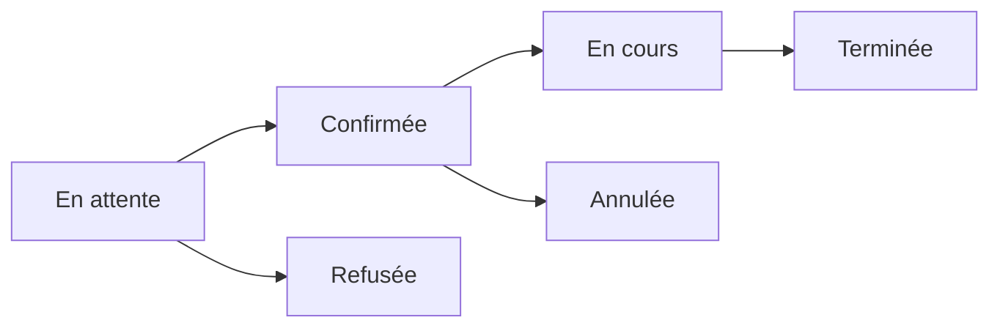

# 📚 Guide Complet pour les Mentorés - MentorXHub

*Documentation utilisateur - Application Mentoring*

---

## 🎯 Bienvenue !

Ce guide vous accompagne pas à pas dans l'utilisation de MentorXHub en tant que **mentoré** (étudiant). Vous apprendrez à trouver le mentor idéal, réserver des sessions et progresser dans vos apprentissages.

---

## 📋 Table des Matières

1. [Première Connexion et Onboarding](#première-connexion-et-onboarding)
2. [Compléter Votre Profil](#compléter-votre-profil)
3. [Rechercher un Mentor](#rechercher-un-mentor)
4. [Réserver une Session](#réserver-une-session)
5. [Participer à une Session Vidéo](#participer-à-une-session-vidéo)
6. [Donner un Feedback](#donner-un-feedback)
7. [Gérer Vos Sessions](#gérer-vos-sessions)
8. [FAQ et Astuces](#faq-et-astuces)

---

## 🚀 Première Connexion et Onboarding

### Étape 1 : Créer un Compte

Deux options s'offrent à vous :

**Option A : Inscription par Email**
1. Cliquez sur **"S'inscrire"** sur la page d'accueil
2. Remplissez le formulaire :
   - Adresse email
   - Mot de passe (minimum 8 caractères)
   - Confirmation du mot de passe
3. Cliquez sur **"Créer mon compte"**
4. Vérifiez votre email et confirmez votre inscription

**Option B : Connexion avec Google**
1. Cliquez sur **"Continuer avec Google"**
2. Sélectionnez votre compte Google
3. Autorisez MentorXHub à accéder à vos informations de base

### Étape 2 : Choisir Votre Rôle

Après la première connexion, vous devez choisir votre rôle :

1. La page **"Sélection du rôle"** s'affiche automatiquement
2. Sélectionnez **"Mentoré"** (étudiant)
3. Cliquez sur **"Continuer"**

### Étape 3 : Onboarding (Optionnel)

> [!NOTE]
> L'onboarding est **optionnel** pour les mentorés. Vous pouvez le compléter maintenant ou plus tard, ou même le passer complètement.

**Informations demandées :**
- **Niveau d'études** : Débutant, Intermédiaire ou Avancé
- **Objectifs d'apprentissage** : Décrivez ce que vous souhaitez apprendre
- **Centres d'intérêt** : Sélectionnez les matières qui vous intéressent (plusieurs choix possibles)
- **Langues préférées** : Langues que vous parlez ou langages de programmation
- **Profil GitHub** : Lien vers votre profil (optionnel)

**Options :**
- **"Passer"** : Accéder directement au dashboard sans remplir le formulaire
- **"Sauvegarder"** : Enregistrer vos informations et continuer

---

## 👤 Compléter Votre Profil

Un profil complet vous aide à trouver les meilleurs mentors et à recevoir des recommandations personnalisées.

### Accéder à Votre Profil

1. Connectez-vous à votre compte
2. Cliquez sur votre **avatar** en haut à droite
3. Sélectionnez **"Mon Profil"**

### Modifier Votre Profil

**Menu de navigation :**
- **📊 Vue d'ensemble** : Statistiques de vos sessions
- **✏️ Modifier le profil** : Mettre à jour vos informations
- **🎯 Mes sessions** : Historique complet

**Informations modifiables :**

| Champ | Description | Obligatoire |
|-------|-------------|-------------|
| Photo de profil | Avatar affiché sur la plateforme | Non |
| Niveau | Débutant, Intermédiaire, Avancé | Non |
| Objectifs | Ce que vous voulez apprendre | Non |
| Centres d'intérêt | Matières qui vous intéressent | Non |
| Langues | Langues parlées et langages tech | Non |
| GitHub | URL de votre profil GitHub | Non |

**Conseils pour un profil attractif :**
- ✅ Utilisez une photo de profil professionnelle
- ✅ Soyez précis dans vos objectifs d'apprentissage
- ✅ Sélectionnez tous vos centres d'intérêt pertinents
- ✅ Mentionnez vos projets ou expériences

---

## 🔍 Rechercher un Mentor

### Accéder à la Liste des Mentors

**Depuis le Dashboard :**
1. Cliquez sur **"Mentors"** dans le menu de navigation
2. La liste paginée des mentors s'affiche (12 par page)

**Depuis la Page d'Accueil :**
1. Cliquez sur **"Trouver un Mentor"**

### Utiliser les Filtres

La recherche est optimisée avec plusieurs filtres :

**Filtres disponibles :**

| Filtre | Options | Description |
|--------|---------|-------------|
| **Recherche** | Texte libre | Recherche dans le nom, expertise, bio |
| **Expertise** | Liste déroulante | Filtrer par domaine (Web Dev, Data Science, etc.) |
| **Langues** | Liste déroulante | Langues parlées par le mentor |
| **Tarif Max** | Nombre | Prix maximum par heure (en €) |

**Exemple de recherche :**
```
Recherche : "Python"
Expertise : Data Science
Langues : Français
Tarif Max : 50€
```

### Comprendre les Cartes Mentor

Chaque carte mentor affiche :

- **Photo de profil**
- **Nom complet**
- **Expertise principale**
- **Note moyenne** ⭐ (sur 5)
- **Nombre de sessions** réalisées
- **Tarif horaire** en €
- **Langues parlées**
- **Bouton "Voir le profil"**

**Légende des icônes :**
- ⭐⭐⭐⭐⭐ : Note moyenne
- 📚 : Nombre de sessions complétées
- 💰 : Tarif horaire
- 🌐 : Langues

---

## 📅 Réserver une Session

### Étape 1 : Consulter le Profil du Mentor

1. Cliquez sur **"Voir le profil"** sur la carte du mentor
2. Le profil public s'affiche avec :
   - Informations détaillées
   - Expertise et certifications
   - Disponibilités
   - Avis des autres mentorés
   - Lien vers LinkedIn/GitHub

### Étape 2 : Vérifier les Disponibilités

**Section "Disponibilités" :**
- Jours de la semaine disponibles
- Plages horaires
- Créneaux récurrents ou ponctuels

**Exemple :**
```
Lundi : 14h00 - 18h00
Mercredi : 10h00 - 12h00
Vendredi : 16h00 - 20h00
```

### Étape 3 : Créer une Demande de Session

1. Cliquez sur **"Réserver une session"**
2. Remplissez le formulaire :

**Informations requises :**

| Champ | Description | Exemple |
|-------|-------------|---------|
| **Titre** | Sujet de la session | "Introduction à Python" |
| **Description** | Détails et objectifs | "J'aimerais apprendre les bases..." |
| **Date** | Date souhaitée | 2025-12-25 |
| **Heure de début** | Heure de début | 14:00 |
| **Heure de fin** | Heure de fin | 15:30 |
| **Lien de réunion** | (Optionnel) Votre propre lien | https://meet.google.com/... |

3. Cliquez sur **"Envoyer la demande"**

### Statut de la Demande

Après soumission, votre demande a le statut **"En attente"** (pending).

**États possibles :**



| Statut | Description | Action |
|--------|-------------|--------|
| 🟡 **En attente** | Le mentor n'a pas encore répondu | Attendre la réponse |
| 🟢 **Confirmée** | Le mentor a accepté | Préparez-vous pour la session |
| 🔴 **Refusée** | Le mentor a décliné | Cherchez un autre créneau |
| 🔵 **En cours** | Session en cours de déroulement | Participez activement |
| ⚫ **Annulée** | Session annulée par l'une des parties | - |
| ✅ **Terminée** | Session complétée | Donnez un feedback |

### Notifications

Vous recevez des notifications pour :
- ✅ Confirmation de session par le mentor
- ❌ Refus de session
- ⏰ Rappel 24h avant la session
- 🎥 Lien de session vidéo disponible

---

## 🎥 Participer à une Session Vidéo

### Avant la Session

**Préparez-vous :**
- ✅ Testez votre connexion internet
- ✅ Vérifiez votre micro et caméra
- ✅ Préparez vos questions
- ✅ Ayez vos notes à portée de main

### Rejoindre la Session

**Option 1 : Depuis le Dashboard**
1. Accédez à **"Mes Sessions"**
2. Trouvez la session confirmée
3. Cliquez sur **"Rejoindre la session"** (bouton visible 15 min avant l'heure)

**Option 2 : Depuis les Notifications**
1. Cliquez sur la notification de session
2. Cliquez sur **"Rejoindre"**

### Utilisation de Jitsi Meet

MentorXHub utilise **Jitsi Meet** pour les visioconférences.

**Interface Jitsi :**

```
┌─────────────────────────────────────┐
│  🎥 Votre Vidéo  │  🎥 Vidéo Mentor │
├─────────────────────────────────────┤
│                                     │
│        Zone de Partage d'Écran      │
│                                     │
├─────────────────────────────────────┤
│  🎤 💬 📹 🖥️ ✋ ⋯ 📞               │
└─────────────────────────────────────┘
```

**Contrôles disponibles :**

| Icône | Action | Raccourci |
|-------|--------|-----------|
| 🎤 | Activer/Désactiver le micro | M |
| 📹 | Activer/Désactiver la caméra | V |
| 💬 | Ouvrir le chat | C |
| 🖥️ | Partager l'écran | D |
| ✋ | Lever la main | R |
| ⋯ | Plus d'options | - |
| 📞 | Quitter la session | - |

**Fonctionnalités avancées :**
- Chat textuel pour partager des liens
- Partage d'écran pour montrer votre code
- Enregistrement (si activé par le mentor)
- Mode grille ou mode présentateur

### Pendant la Session

**Bonnes pratiques :**
- ✅ Activez votre caméra pour une meilleure interaction
- ✅ Coupez votre micro quand vous n'écoutez
- ✅ Utilisez le chat pour les questions
- ✅ Prenez des notes
- ✅ N'hésitez pas à demander des clarifications

### Fin de Session

1. Le mentor ou vous cliquez sur **"Raccrocher"** 📞
2. Vous êtes automatiquement redirigé vers la page de la session
3. Un formulaire de feedback s'affiche

---

## ⭐ Donner un Feedback

Le feedback aide les autres mentorés et motive les mentors !

### Accéder au Formulaire de Feedback

**Automatique :**
- Après avoir quitté la session vidéo
- La page de feedback s'affiche automatiquement

**Manuel :**
1. Accédez à **"Mes Sessions"**
2. Trouvez la session terminée
3. Cliquez sur **"Donner un avis"**

### Remplir le Feedback

**Informations demandées :**

**1. Note (obligatoire)**
- Échelle de 1 à 5 étoiles
- ⭐ = Très insatisfait
- ⭐⭐⭐⭐⭐ = Excellent

**2. Commentaire (obligatoire)**
- Minimum 50 caractères recommandé
- Soyez constructif et précis

**Exemple de bon feedback :**
```
⭐⭐⭐⭐⭐ (5/5)

"Session très enrichissante avec Jean ! Il a su expliquer
les concepts de programmation orientée objet de manière 
claire et avec des exemples concrets. J'ai particulièrement 
apprécié sa patience et sa pédagogie. Je recommande vivement 
pour tous les débutants en Python !"
```

**Conseils pour un feedback utile :**
- ✅ Mentionnez les points forts du mentor
- ✅ Soyez précis sur ce que vous avez appris
- ✅ Indiquez si vous recommandez ce mentor
- ✅ Restez respectueux même si insatisfait
- ❌ Évitez les commentaires trop courts ou vagues

### Impact du Feedback

- **Pour le mentor** : Met à jour sa note moyenne publique
- **Pour vous** : Historique de vos sessions et avis
- **Pour la communauté** : Aide les autres mentorés à choisir

---

## 📊 Gérer Vos Sessions

### Tableau de Bord "Mes Sessions"

Accédez à toutes vos sessions depuis **Dashboard > Mes Sessions**.

**Filtres disponibles :**
- **Toutes** : Toutes les sessions
- **En attente** : Demandes non traitées
- **Confirmées** : Sessions validées à venir
- **Terminées** : Sessions passées
- **Annulées** : Sessions annulées

### Détails d'une Session

Cliquez sur une session pour voir :
- **Informations générales** : Titre, date, heure
- **Mentor assigné** : Nom, photo, expertise
- **Description** : Détails de la session
- **Statut actuel** : Indication visuelle
- **Actions disponibles** : Selon le statut

### Actions Possibles

**Avant la confirmation :**
- ✏️ **Modifier** : Changer date/heure/description
- 🗑️ **Annuler** : Supprimer la demande

**Après confirmation :**
- 🎥 **Rejoindre** : Accéder à la visio (15 min avant)
- ❌ **Annuler** : Annuler la session (prévenir 24h avant)

**Après la session :**
- ⭐ **Feedback** : Donner votre avis
- 📄 **Voir les notes** : Consulter les notes partagées

### Statistiques Personnelles

**Dashboard > Vue d'ensemble** affiche :
- **Total de sessions** : Nombre total
- **Sessions à venir** : Prochaines sessions
- **Heures de mentorat** : Temps total
- **Mentors rencontrés** : Nombre de mentors différents

---

## ❓ FAQ et Astuces

### Questions Fréquentes

**Q : L'onboarding est-il obligatoire ?**
> Non ! L'onboarding est optionnel pour les mentorés. Vous pouvez le passer ou le compléter plus tard depuis votre profil.

**Q : Puis-je réserver plusieurs sessions avec le même mentor ?**
> Oui, absolument ! Vous pouvez créer autant de sessions que vous le souhaitez avec vos mentors favoris.

**Q : Que se passe-t-il si le mentor refuse ma demande ?**
> Vous recevez une notification et pouvez chercher un autre mentor ou proposer un nouveau créneau.

**Q : Puis-je annuler une session confirmée ?**
> Oui, mais nous recommandons de prévenir au moins 24h à l'avance par respect pour le mentor.

**Q : Le lien de visio est-il automatique ?**
> Par défaut, un lien Jitsi est généré automatiquement. Vous pouvez aussi fournir votre propre lien (Google Meet, Zoom, etc.).

**Q : Mes données personnelles sont-elles sécurisées ?**
> Oui, toutes vos données sont cryptées et ne sont jamais partagées sans votre consentement.

**Q : Combien coûte une session ?**
> Le tarif dépend de chaque mentor et est affiché sur leur profil (généralement entre 20€ et 80€/heure).

**Q : Comment payer une session ?**
> Le paiement se fait via la plateforme après confirmation de la session. Plusieurs moyens de paiement sont acceptés.

### Astuces pour Réussir

**🎯 Trouver le Bon Mentor**
- Lisez attentivement les avis des autres mentorés
- Consultez le profil LinkedIn/GitHub du mentor
- Vérifiez que ses disponibilités correspondent aux vôtres
- Privilégiez les mentors avec beaucoup de sessions complétées

**📅 Préparer Votre Session**
- Définissez des objectifs clairs avant la session
- Préparez vos questions à l'avance
- Partagez vos projets ou code avec le mentor si pertinent
- Soyez ponctuel !

**🤝 Pendant la Session**
- Soyez actif et posez des questions
- Prenez des notes
- N'ayez pas peur de demander de répéter
- Respectez le temps imparti

**⭐ Après la Session**
- Laissez un feedback honnête et constructif
- Appliquez rapidement ce que vous avez appris
- Planifiez une session de suivi si nécessaire
- Gardez contact avec vos mentors préférés

### Raccourcis Clavier (Dashboard)

| Raccourci | Action |
|-----------|--------|
| `G` + `M` | Aller à "Mes Sessions" |
| `G` + `P` | Aller à "Mon Profil" |
| `G` + `D` | Aller au Dashboard |
| `/` | Rechercher un mentor |
| `N` | Voir les notifications |
| `?` | Afficher l'aide |

---

## 🆘 Besoin d'Aide ?

### Support Technique

**Problèmes de connexion :**
- Email : support@mentorxhub.com
- Chat en direct : Cliquez sur l'icône 💬 en bas à droite

**Problèmes avec un mentor :**
- Utilisez le système de réclamation dans l'interface
- Contactez l'équipe MentorXHub

### Ressources Supplémentaires

- 📖 [Guide Technique Complet](ETAT_COMPLET_APP_MENTORING.md)
- 🎥 [Tutoriels Vidéo](https://youtube.com/mentorxhub)
- 💬 [Forum Communauté](https://community.mentorxhub.com)
- 📧 contact@mentorxhub.com

---

**Bonne chance dans votre parcours d'apprentissage ! 🚀**

*MentorXHub - Votre Plateforme de Mentorat*
