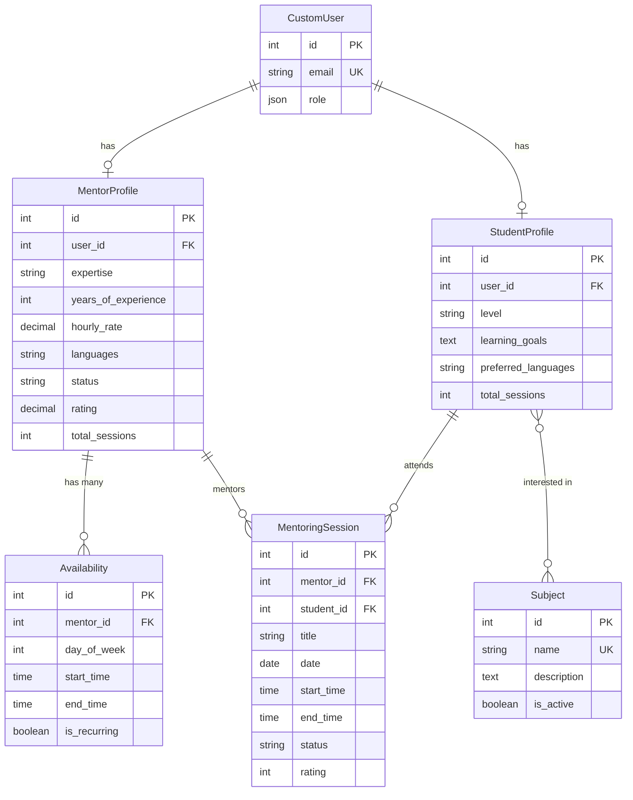
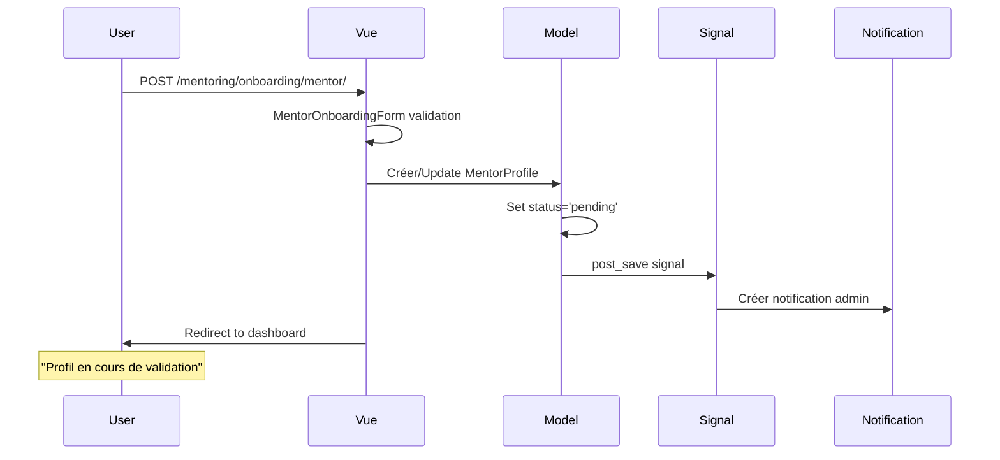
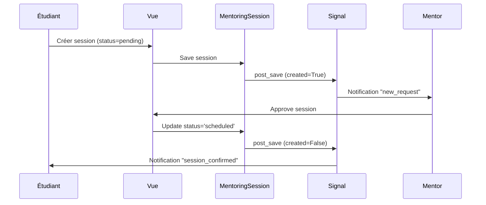

# 🎓 Application Mentoring - Documentation Développeur

*Documentation technique pour le dossier `/mentoring/`*

---

## 🎯 Vue d'Ensemble

L'application **mentoring** est l'une des 4 applications principales de MentorXHub. Elle gère tout le système de mentorat : profils, sessions, disponibilités, recherche de mentors et visioconférences.

**URL de l'application :** `http://127.0.0.1:8000/mentoring/`

---

## 📁 Structure du Dossier

```
mentoring/
├── __init__.py                  # Package Python
├── admin.py                     # Configuration Django Admin (3 modèles)
├── api_views.py                 # API REST (1 endpoint JSON)
├── apps.py                      # Configuration de l'app
├── forms.py                     # 7 formulaires Django
├── models.py                    # 5 modèles de données
├── signals.py                   # Notifications automatiques (post_save)
├── urls.py                      # 18 routes URL
│
├── management/
│   └── commands/                # Commandes Django personnalisées
│
├── migrations/                  # 12 migrations de base de données
│   ├── 0001_initial.py
│   ├── 0002_...
│   └── ...
│
├── static/mentoring/
│   ├── css/                     # 10 fichiers CSS
│   │   ├── mentor_list.css
│   │   ├── mentor_profile.css
│   │   ├── student_profile.css
│   │   ├── availability.css
│   │   ├── session.css
│   │   ├── onboarding.css
│   │   └── ...
│   └── js/                      # 6 fichiers JavaScript
│       ├── mentee_onboarding.js (9.3 Ko)
│       ├── profile_update.js (5.2 Ko)
│       ├── session_feedback.js (2.7 Ko)
│       ├── student_dashboard.js (1.0 Ko)
│       ├── onboarding.js (671 octets)
│       └── mentors_list.js (315 octets)
│
├── templates/mentoring/
│   ├── mentor_list.html         # Liste des mentors (liste paginée)
│   ├── mentor_public_profile.html  # Profil public mentor
│   ├── mentor_profile_update.html  # Édition profil mentor
│   ├── student_profile.html     # Profil étudiant
│   ├── student_profile_update.html # Édition profil étudiant
│   ├── availability_list.html   # Liste disponibilités
│   ├── availability_form.html   # Form disponibilité
│   ├── availability_confirm_delete.html
│   ├── session_form.html        # Form création session
│   ├── session_feedback.html    # Form feedback
│   ├── mentor_dashboard.html    # Dashboard mentor
│   ├── student_dashboard.html   # Dashboard étudiant
│   ├── fragments/
│   │   └── mentor_card.html     # Fragment HTMX
│   └── onboarding/
│       ├── mentee.html          # Onboarding mentoré
│       └── mentor.html          # Onboarding mentor
│
├── tests/
│   ├── __init__.py
│   └── test_onboarding_crash.py # Tests (à compléter)
│
└── views/
    ├── __init__.py
    ├── main.py                  # 21 vues principales (448 lignes)
    └── onboarding/
        ├── __init__.py
        ├── mentee.py            # Onboarding mentorés (2 vues)
        └── mentor.py            # Onboarding mentors (1 vue)
```

**Total :** 76 fichiers

---

## 🔗 Intégration dans le Projet

### URLs Principales

**Configuration :** `mentorxhub/urls.py`
```python
urlpatterns = [
    # ...
    path('mentoring/', include('mentoring.urls')),  # ← Toutes les routes /mentoring/*
    # ...
]
```

**Routes de l'app :** `mentoring/urls.py`
```python
app_name = 'mentoring'  # Namespace

urlpatterns = [
    # Mentors
    path('mentors/', views.MentorListView.as_view(), name='mentor_list'),
    path('mentor/<int:pk>/', views.PublicMentorProfileView.as_view(), name='mentor_detail'),
    
    # Sessions
    path('sessions/', views.MentoringSessionListView.as_view(), name='session_list'),
    path('sessions/<int:pk>/', views.MentoringSessionDetailView.as_view(), name='session_detail'),
    path('sessions/create/<int:mentor_id>/', views.MentoringSessionCreateView.as_view(), name='session_create'),
    path('sessions/<int:pk>/approve/', views.SessionApproveView.as_view(), name='session_approve'),
    
    # Onboarding
    path('onboarding/mentee/', views.MenteeOnboardingView.as_view(), name='mentee_onboarding'),
    path('onboarding/mentor/', views.MentorOnboardingView.as_view(), name='mentor_onboarding'),
    
    # API
    path('api/mentors/', api_views.MentorListAPIView.as_view(), name='mentor_list_api'),
]
```

**Accès dans les templates :**
```django



```

---

## 💾 Modèles de Données

### Schéma de la Base de Données



### Tables Créées

| Table | Nom SQL | Lignes principales |
|-------|---------|-------------------|
| **Subject** | `mentoring_subject` | name, description, is_active |
| **MentorProfile** | `mentoring_mentorprofile` | user_id, expertise, hourly_rate, status |
| **StudentProfile** | `mentoring_studentprofile` | user_id, level, learning_goals |
| **Availability** | `mentoring_availability` | mentor_id, day_of_week, start_time, end_time |
| **MentoringSession** | `mentoring_mentoringsession` | mentor_id, student_id, date, status |
| **StudentProfile_interests** | `mentoring_studentprofile_interests` | studentprofile_id, subject_id |

---

## 🎮 Vues Principales

### Fichier `views/main.py` (21 vues)

**Catégories de vues :**

#### 1. Vues Publiques (sans authentification)
```python
MentorListView           # GET /mentoring/mentors/
PublicMentorProfileView  # GET /mentoring/mentor/<pk>/
```

#### 2. Vues Profils (authentification requise)
```python
MentorProfileUpdateView    # GET/POST /mentoring/mentor/profile/update/
StudentProfileView         # GET /mentoring/student/profile/
StudentProfileUpdateView   # GET/POST /mentoring/student/profile/update/
```

#### 3. Vues Disponibilités (mentors uniquement)
```python
AvailabilityListView      # GET /mentoring/mentor/availabilities/
AvailabilityCreateView    # GET/POST /mentoring/mentor/availabilities/create/
AvailabilityUpdateView    # GET/POST /mentoring/mentor/availabilities/<pk>/update/
AvailabilityDeleteView    # POST /mentoring/mentor/availabilities/<pk>/delete/
```

#### 4. Vues Sessions
```python
MentoringSessionListView          # GET /mentoring/sessions/
MentoringSessionDetailView        # GET /mentoring/sessions/<pk>/
MentoringSessionCreateView        # POST /mentoring/sessions/create/<mentor_id>/
MentorMentoringSessionCreateView  # POST /mentoring/mentor/sessions/create/
MentoringSessionUpdateView        # GET/POST /mentoring/sessions/<pk>/update/
MentoringSessionDeleteView        # POST /mentoring/sessions/<pk>/delete/
SessionFeedbackView               # GET/POST /mentoring/sessions/<pk>/feedback/
SessionApproveView                # POST /mentoring/sessions/<pk>/approve/
SessionRejectView                 # POST /mentoring/sessions/<pk>/reject/
```

### Fichier `views/onboarding/mentee.py` (2 vues)
```python
MenteeOnboardingView       # GET/POST /mentoring/onboarding/mentee/
SkipMenteeOnboardingView   # POST /mentoring/onboarding/mentee/skip/
```

### Fichier `views/onboarding/mentor.py` (1 vue)
```python
MentorOnboardingView       # GET/POST /mentoring/onboarding/mentor/
```

---

## 📝 Formulaires

**Fichier :** `forms.py` (292 lignes)

| Formulaire | Modèle | Champs | Utilisation |
|-----------|--------|--------|-------------|
| `MentorProfileForm` | MentorProfile | 8 champs | Mise à jour profil mentor |
| `StudentProfileForm` | StudentProfile | 5 champs | Mise à jour profil étudiant |
| `AvailabilityForm` | Availability | 4 champs | Créer/modifier disponibilité |
| `MentoringSessionForm` | MentoringSession | 6 champs | Créer session (étudiant) |
| `MentorMentoringSessionForm` | MentoringSession | 7 champs | Créer session (mentor) |
| `SessionFeedbackForm` | MentoringSession | 2 champs | Ajouter feedback |
| `MenteeOnboardingForm` | StudentProfile | 5 champs | Onboarding mentoré |
| `MentorOnboardingForm` | MentorProfile | 5 champs | Onboarding mentor |

**Validations personnalisées :**
- `AvailabilityForm.clean()` : Vérifie que end_time > start_time
- `MentorMentoringSessionForm.clean()` : Vérifie date dans le futur

---

## 🔔 Signals

**Fichier :** `signals.py` (48 lignes)

**Signal configuré :** `post_save` sur `MentoringSession`

**Notifications automatiques :**

| Événement | Condition | Destinataire | Type | Message |
|-----------|-----------|--------------|------|---------|
| Création | `created=True, status='pending'` | Mentor | new_request | "Nouvelle demande de session" |
| Mise à jour | `status='scheduled'` | Étudiant | session_confirmed | "Session confirmée !" |
| Mise à jour | `status='rejected'` | Étudiant | session_cancelled | "Demande refusée" |

**Code :**
```python
from django.db.models.signals import post_save
from django.dispatch import receiver
from .models import MentoringSession
from dashboard.models import Notification

@receiver(post_save, sender=MentoringSession)
def notify_session_status_change(sender, instance, created, **kwargs):
    # Logique de notification
```

**Enregistrement du signal :**
```python
# apps.py
class MentoringConfig(AppConfig):
    name = 'mentoring'
    
    def ready(self):
        import mentoring.signals  # ← Import ici
```

---

## 🎨 Frontend

### CSS (10 fichiers)

**Localisation :** `static/mentoring/css/`

Styles organisés par fonctionnalité :
- Design moderne (glassmorphism, neumorphism)
- Dark mode support via variables CSS
- Responsive design
- Animations et transitions

**Chargement dans les templates :**
```django

<link rel="stylesheet" href="">
```

### JavaScript (6 fichiers)

**Localisation :** `static/mentoring/js/`

**JavaScript Vanilla (pas de framework)**

| Fichier | Taille | Fonctionnalités |
|---------|--------|-----------------|
| `mentee_onboarding.js` | 9.3 Ko | Formulaire dynamique, validation |
| `profile_update.js` | 5.2 Ko | Upload avatar, prévisualisation |
| `session_feedback.js` | 2.7 Ko | Rating interactif, validation |
| `student_dashboard.js` | 1.0 Ko | Statistiques dynamiques |
| `onboarding.js` | 671 octets | Navigation onboarding |
| `mentors_list.js` | 315 octets | Filtres dynamiques |

**Chargement :**
```django

<script src=""></script>

```

---

## 🔌 Intégrations Externes

### Jitsi Meet (Visioconférence)

**Template :** `templates/dashboard/sessions/video_room.html` (dans l'app `dashboard`)

**API utilisée :** Jitsi Meet External API

**CDN :**
```html
<script src='https://meet.jit.si/external_api.js'></script>
```

**Configuration :**
```javascript
const api = new JitsiMeetExternalAPI('meet.jit.si', {
    roomName: 'session-{{ session.id }}-{{ timestamp }}',
    userInfo: {
        email: '{{ user.email }}',
        displayName: '{{ user.get_full_name }}'
    },
    lang: 'fr'
});
```

### Notifications (Dashboard App)

**Dépendance :** `dashboard.models.Notification`

**Import dans les signals :**
```python
from dashboard.models import Notification
```

---

## 🔒 Permissions et Accès

### Mixins Utilisés

**Django Built-in :**
- `LoginRequiredMixin` : Authentification requise
- `UserPassesTestMixin` : Vérification personnalisée

**Exemple de protection :**
```python
class AvailabilityCreateView(LoginRequiredMixin, UserPassesTestMixin, CreateView):
    def test_func(self):
        # Seuls les mentors peuvent créer des disponibilités
        return 'mentor' in self.request.user.role
```

### Matrice des Permissions

| Vue | Authentification | Rôle requis | Vérification supplémentaire |
|-----|------------------|-------------|----------------------------|
| `MentorListView` | ❌ Non | Aucun | - |
| `PublicMentorProfileView` | ❌ Non | Aucun | - |
| `MentorProfileUpdateView` | ✅ Oui | mentor | Modifier SON profil uniquement |
| `StudentProfileView` | ✅ Oui | student | - |
| `AvailabilityCreateView` | ✅ Oui | mentor | - |
| `MentoringSessionCreateView` | ✅ Oui | student | - |
| `SessionApproveView` | ✅ Oui | mentor | Approuver SES sessions uniquement |
| `MenteeOnboardingView` | ✅ Oui | Aucun | - |
| `MentorOnboardingView` | ✅ Oui | mentor | - |

---

## 🧪 Tests

### Structure Actuelle

```
tests/
├── __init__.py
└── test_onboarding_crash.py  # Tests basiques
```

### Tests à Créer (Recommandés)

```
tests/
├── __init__.py
├── test_models.py              # Tests modèles (Subject, MentorProfile, etc.)
├── test_views.py               # Tests vues (ListView, CreateView, etc.)
├── test_forms.py               # Tests formulaires (validation)
├── test_permissions.py         # Tests accès et permissions
├── test_signals.py             # Tests notifications
└── test_onboarding.py          # Tests workflow onboarding
```

**Lancer les tests :**
```bash
# Tous les tests de l'app
python manage.py test mentoring

# Un fichier spécifique
python manage.py test mentoring.tests.test_models

# Avec verbosité
python manage.py test mentoring --verbosity=2
```

---

## 🚀 Démarrage Rapide

### 1. Installation

```bash
# Activer l'environnement virtuel (Windows)
.\mon_env\Scripts\activate

# Ou (Linux/Mac)
source mon_env/bin/activate

# Installer les dépendances
pip install -r requirements.txt
```

### 2. Migrations

```bash
# Appliquer les migrations
python manage.py migrate mentoring

# Vérifier
python manage.py showmigrations mentoring
```

### 3. Créer des Données de Test

```bash
# Via le shell
python manage.py shell
```

```python
from accounts.models import CustomUser
from mentoring.models import MentorProfile, Subject

# Créer une matière
subject = Subject.objects.create(name='Python', is_active=True)

# Créer un mentor
user = CustomUser.objects.create_user(
    email='mentor@test.com',
    password='testpass123'
)
mentor = MentorProfile.objects.create(
    user=user,
    expertise='Python',
    years_of_experience=5,
    hourly_rate=50.00,
    languages='Français, Python',
    status='approved'
)
```

### 4. Lancer le Serveur

```bash
python manage.py runserver
```

**URLs à tester :**
- http://127.0.0.1:8000/mentoring/mentors/
- http://127.0.0.1:8000/mentoring/onboarding/mentee/
- http://127.0.0.1:8000/admin/ (pour l'admin)

---

## 📊 Statistiques du Code

| Métrique | Valeur |
|----------|--------|
| **Lignes de code Python** | ~1,165 |
| **Modèles** | 5 |
| **Vues** | 22 |
| **Formulaires** | 7 |
| **Templates** | 15+ |
| **Fichiers CSS** | 10 |
| **Fichiers JS** | 6 |
| **URLs** | 18 |
| **Migrations** | 12 |
| **Fichiers totaux** | 76 |

---

## 🔄 Workflows Importants

### Workflow d'Onboarding Mentor



### Workflow de Session



---

## 📚 Documentation Complète

Pour plus de détails, consultez :

- **[État Complet de l'Application](../ETAT_COMPLET_APP_MENTORING.md)** - Vue d'ensemble complète
- **[API Reference](docs/guides/API_REFERENCE.md)** - Documentation technique détaillée
- **[Guide Admin](docs/guides/GUIDE_ADMIN.md)** - Administration de l'app
- **[Troubleshooting](docs/guides/TROUBLESHOOTING.md)** - Résolution de problèmes
- **[Architecture Technique](../TECHNICAL_ARCHITECTURE.md)** - Architecture du projet

---

## 🤝 Contribution

### Conventions de Code

**Python :**
- PEP 8
- Docstrings pour les classes et méthodes complexes
- Type hints recommandés

**JavaScript :**
- ES6+
- Commentaires pour la logique complexe
- Vanilla JS (pas de framework)

**Templates :**
- Format Django standard
- Indentation 2 espaces
- Commentaires en français

### Processus de Développement

1. **Créer une branche :**
   ```bash
   git checkout -b feature/nom-feature
   ```

2. **Faire vos modifications**

3. **Créer une migration si nécessaire :**
   ```bash
   python manage.py makemigrations mentoring
   ```

4. **Tester :**
   ```bash
   python manage.py test mentoring
   ```

5. **Commit et Push :**
   ```bash
   git add .
   git commit -m "feat(mentoring): Description"
   git push origin feature/nom-feature
   ```

6. **Créer une Pull Request**

---

## 📞 Support

**Questions techniques :**
- Email : dev@mentorxhub.com
- Slack : #dev-mentoring
- GitHub Issues : [lien vers repo]

**Documentation :**
- Wiki interne : [lien]
- Confluence : [lien]

---

**MentorXHub - Application Mentoring**  
*Développé avec Django 5.1.7 • Python 3.14 • HTMX • Jitsi Meet*
