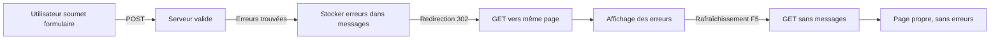

# Pattern Post-Redirect-Get (PRG) - Guide de Référence

## 📌 Le Problème

Lorsqu'un formulaire est soumis en **POST** et qu'il y a des erreurs, Django recharge la page avec les erreurs affichées. Si l'utilisateur rafraîchit la page (F5), le navigateur :
- ❌ Propose de **re-soumettre le formulaire** (popup agaçante)
- ❌ Les **messages d'erreur persistent** même après rafraîchissement
- ❌ Mauvaise expérience utilisateur

## ✅ La Solution : Pattern Post-Redirect-Get (PRG)

Au lieu de recharger directement la page avec les erreurs, on fait une **redirection GET** après le POST. Les erreurs sont stockées dans les **messages Django** (en session).

### Architecture du Pattern



## 🔧 Implémentation Django

### 1. Modifier la Vue (views.py)

```python
from django.contrib import messages
from django.shortcuts import redirect

class CustomLoginView(LoginView):
    template_name = 'accounts/login.html'
    
    def form_valid(self, form):
        # Votre logique de validation
        user = authenticate(username=email, password=password)
        
        if user is not None:
            login(self.request, user)
            return redirect('home')
        else:
            # ✅ Stocker l'erreur et rediriger (PRG)
            messages.error(self.request, 'Email ou mot de passe incorrect.')
            return redirect('accounts:login')
    
    def form_invalid(self, form):
        # ✅ Parcourir toutes les erreurs du formulaire
        for field, errors in form.errors.items():
            for error in errors:
                messages.error(self.request, error)
        
        # ✅ Rediriger au lieu de retourner la réponse avec le formulaire
        return redirect('accounts:login')
```

### 2. Afficher les Messages dans le Template

```django
<form method="post">
    
    
    <!-- ✅ Affichage des messages Django -->
    
        
            
            <div class="error-box" role="alert">
                {{ message }}
            </div>
            
            <div class="success-box" role="alert">
                {{ message }}
            </div>
            
        
    
    
    <!-- Vos champs de formulaire -->
</form>
```

## 🎯 Avantages du Pattern PRG

| Aspect | Sans PRG | Avec PRG |
|--------|----------|----------|
| **Rafraîchissement** | Popup "Re-soumettre le formulaire" | Rafraîchissement simple (GET) |
| **Messages d'erreur** | Persistent après F5 | Disparaissent après F5 |
| **URL** | Reste en POST | Devient GET propre |
| **Expérience utilisateur** | ⚠️ Confuse | ✅ Fluide |
| **SEO/Bookmarking** | ❌ Impossible de bookmarker | ✅ URL propre bookmarkable |

## 🔑 Points Clés à Retenir

> [!IMPORTANT]
> **Les messages Django sont automatiquement supprimés après affichage**. Ils sont stockés en session et consommés lors du premier affichage.

> [!TIP]
> Utilisez ce pattern pour **TOUS vos formulaires** (login, signup, contact, etc.) pour une expérience utilisateur cohérente.

> [!WARNING]
> N'oubliez pas d'importer `messages` et `redirect` dans vos vues :
> ```python
> from django.contrib import messages
> from django.shortcuts import redirect
> ```

## 📝 Checklist d'Implémentation

- [ ] Importer `messages` et `redirect` dans `views.py`
- [ ] Modifier `form_invalid()` pour rediriger au lieu de retourner la réponse
- [ ] Stocker les erreurs dans `messages.error()`
- [ ] Ajouter `` dans le template
- [ ] Tester la soumission avec erreurs
- [ ] Tester le rafraîchissement de la page (F5)
- [ ] Vérifier que les erreurs disparaissent après F5

## 🎨 Styles CSS Recommandés

```css
/* Message d'erreur */
.error-box {
    padding: 1rem;
    background: #FEE2E2;
    border: 1px solid #FCA5A5;
    border-radius: 12px;
    color: #991B1B;
    margin-bottom: 1.5rem;
    animation: slideDown 0.3s ease-out;
}

/* Message de succès */
.success-box {
    padding: 1rem;
    background: #D1FAE5;
    border: 1px solid #6EE7B7;
    border-radius: 12px;
    color: #065F46;
    margin-bottom: 1.5rem;
    animation: slideDown 0.3s ease-out;
}

@keyframes slideDown {
    from {
        opacity: 0;
        transform: translateY(-10px);
    }
    to {
        opacity: 1;
        transform: translateY(0);
    }
}
```

## 🔗 Références

- [Django Messages Framework](https://docs.djangoproject.com/en/stable/ref/contrib/messages/)
- [Post/Redirect/Get Pattern (Wikipedia)](https://en.wikipedia.org/wiki/Post/Redirect/Get)

---

**Auteur:** MentorXHub  
**Dernière mise à jour:** 2025-12-01  
**Projet:** [MentorXHub](file:///c:/Users/Moussa/Desktop/Mentorxhub)
